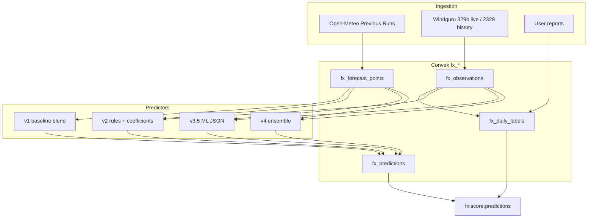

# Forecast experiment — predictions work on `feat/wingfoil-forecast-experiment`

**Branch:** `feat/wingfoil-forecast-experiment`  
**Last updated:** 2026-05-25  
**Scope:** Isolated Cascais Bay wingfoil kick-in prediction experiment (`/experiment/*`, `fx_*` Convex tables, Render cron workers). Does **not** change production `/wing` scoring or Windy scraping.

---

## Executive summary

This branch adds a full **data → labels → models → backtest → live predictions** pipeline for answering: *when will the marina bay become rideable for wingfoiling?*

Four prediction versions were built and compared:

| Version | ID | Role |
|---------|-----|------|
| v1 | `baseline-ensemble-v1` | Multi-model blend + Cabo lag boost (original experiment predictor) |
| v2 | `bay-wind-v2` | Explainable rules: ICON7 day-ahead + mined bias/lag tables |
| v3 / v3.5 | `bay-wind-v3-ml` / `bay-wind-v3.5-ml` | ML kick-in + hourly rideability; v3.5 adds calibrated rideable-day classifier |
| v4 | `bay-wind-v4-ensemble` | Rule hybrid of v2 + v3 (did not beat v3.5 on trust metrics) |

**Best model today:** **v3.5** on Summer 2025 @ 12 kt — MAE ~90 min, false+ 2, precision 98%.  
**Live worker default:** still **v2** (`scripts/fx-generate-predictions.mjs`); v3/v4 available via env.

**Ground-truth constraint (critical):** Windguru station **2329** (Marina CNC) has been offline since **April 2026**. Summer 2026 has **no usable marina observations** for labels or backtest. Training and evaluation must rely on **2024 + 2025** marina history (plus Cabo lag / user reports where documented).

---

## 1. Foundation (committed on branch vs `main`)

### 1.1 Convex schema (`fx_*` tables)

Isolated namespace in `convex/schema.ts`:

| Table | Purpose |
|-------|---------|
| `fx_locations` | `cascais-bay`, `cabo-raso`, `guincho` |
| `fx_observation_sources` | Windguru 3294 (live), 2329 (disabled), IPMA, future marina |
| `fx_forecast_runs` / `fx_forecast_points` | Open-Meteo Previous Runs per model |
| `fx_observations` | Time-series wind obs |
| `fx_user_reports` | Structured “not in / marginal / rideable / strong” |
| `fx_daily_labels` | Derived kick-in / no-kick per day |
| `fx_model_skill_scores` | NWP hourly skill aggregates |
| `fx_predictions` | Stored kick-in predictions by `modelVersion` |
| `fx_worker_runs` | Worker audit log |

API: `convex/forecastExperiment.ts` — dashboard, ingest helpers, label/prediction queries.

### 1.2 Ingestion workers (Render + npm scripts)

| Script | Schedule / use | Role |
|--------|----------------|------|
| `fx:fetch:openmeteo` | Hourly cron | Fetch latest Previous Runs |
| `fx:fetch:observations` | Poll ~5 min | Cabo 3294 live; marina 2329 disabled |
| `fx:backfill:windguru` | Manual | Historical 2329 + 3294 via public `iapi.php` |
| `fx:backfill:openmeteo` | Manual | May–Sep windows per model |
| `fx:build:labels` | Hourly (with score chain) | Build `fx_daily_labels` |
| `fx:score:models` | Hourly | NWP skill → `fx_model_skill_scores` |
| `fx:score:predictions` | Hourly | Score stored predictions vs labels |
| `fx:predict` | Hourly | Generate live predictions |
| `fx:purge:forecast-gaps` | Manual | Data hygiene |

`render.yaml` defines `waterman-fx-openmeteo`, `waterman-fx-labels`, `waterman-fx-observations`.

### 1.3 Shared libraries (`lib/forecast-experiment/`)

| Module | Role |
|--------|------|
| `locations.js` | Sites, `FX_MODELS` (ICON7/13, GFS, ECMWF, ARPEGE) |
| `openMeteoClient.js` | Previous Runs URL builders |
| `windguruClient.js` / `ipmaClient.js` | Obs fetch |
| `units.js` | Effective wind = avg(speed, gust); threshold helpers |
| `time.js` | Lisbon local day windows |
| `labels.js` | Daily label: marina obs → reports → Cabo lag inference |
| `backtest.js` | Day/week backtest builders, MAE |
| `prediction.js` | v1 `buildBaselinePrediction` |
| `skill.js` | Skill metric helpers |
| `analysisSeasons.js` | Summer 2024/2025/2026 + Average season ranges |

### 1.4 Model skill analysis (NWP ranking)

- `modelSkillAnalysis.js` — hourly error, rideable Brier, rankings
- `runModelSkillAnalysis.js` — server-side window fetch from Convex
- Cached API: `GET /api/experiment/wind-model-backtest`
- UI: `/experiment/model-analysis`, `/experiment/model-analysis-nortada`
- Learnings: [forecast-experiment-model-analysis-learnings.md](./forecast-experiment-model-analysis-learnings.md) (ICON-D2/AROME/HARMONIE removed — no Portugal coverage)

### 1.5 Experiment UI shell

| Route | Purpose |
|-------|---------|
| `/experiment` | Live Cabo obs, latest prediction, user reports |
| `/experiment/admin` | Debug / worker status |
| `/experiment/model-analysis` | NWP skill charts |
| `/experiment/model-analysis-nortada` | Nortada-focused skill view |

`app/experiment/layout.js` — nav between dashboard, backtest, kick-in models, model skill, admin.

---

## 2. Bay wind prediction (uncommitted + partial commit on branch)

### 2.1 Rideability presets

`lib/forecast-experiment/rideabilityThresholds.js`:

| Preset | kt |
|--------|-----|
| `windfoil` | 10 |
| `wingfoil-light` | 12 (default) |
| `wingfoil-heavy` | 15 |

Stored on each `fx_predictions` row as `thresholdKnots`.

### 2.2 v2 — `bay-wind-v2`

| File | Role |
|------|------|
| `bayWindCoefficients.js` | Bias by regime/hour, lag-by-peak tables |
| `mineBayWindCoefficients.js` | Mine from paired obs/forecast |
| `bayWindPrediction.js` | `buildBayWindPredictionV2`, probability timeline |
| `loadBayWindCoefficients.js` | Load `data/forecast-experiment/bay-wind-v2-coefficients.json` |
| `scripts/fx-mine-bay-coefficients.mjs` | CLI miner |

**Behaviour:** Single-model day-ahead (`icon-eu-previous-day1` default), regime bias, Cabo lag floor in nowcast mode. Live worker uses nowcast when Cabo obs &lt;6 h old.

**Summer 2025 @ 12 kt (after bias tune):** MAE 257 min, false+ 28, false− 9.

### 2.3 v3 / v3.5 — ML

| File | Role |
|------|------|
| `mlFeatures.js` | Feature vector (GFS, ICON13, ICON7, Cabo @07:00, calendar) |
| `mlDataset.js` | Export rows from Convex window |
| `bayWindPredictionMl.js` | Node inference; `bay-wind-v3.5-ml` when `model.calibration` present |
| `loadBayWindMlModel.js` | Load `data/forecast-experiment/bay-wind-v3-model.json` |
| `ml/bay-wind/train.py` | Train kick-in regressor, hourly classifiers, **calibration optimizer** |
| `scripts/fx-export-ml-dataset.mjs` | JSONL export |
| `scripts/fx-train:bay-ml` | Python train |

**v3.5 calibration (A1):** Rideable-day classifier, per-preset `sessionThreshold` / `kickInThreshold` / `probabilityDamping` tuned on holdout summer.

**Summer 2025 @ 12 kt:** MAE **90 min**, false+ **2**, false− **1**, precision **98%**, recall **99%**.

### 2.4 v4 — rule ensemble

| File | Role |
|------|------|
| `bayWindPredictionV4.js` | Gate: v2 rideable OR (v3 confident + timeline); blend kick-in; Cabo floor |

**Summer 2025 @ 12 kt:** MAE 133 min, false+ **28** (same as v2 — v2 false positives pass through). **Did not meet** hybrid acceptance (MAE ≤100, false+ ≤25).

**Fix applied during wiring:** `v3KickInSupportedByTimeline` — v3-only path requires hourly timeline support, not regressor-only.

### 2.5 Backtest & scoring

| File | Role |
|------|------|
| `predictionBacktest.js` | Season backtest, v1–v4 comparison, overview all presets |
| `predictionBacktestConfig.js` | Model → builder + forecast model mapping |
| `predictionBacktestConstants.js` | `PREDICTION_MODEL_V1`…`V4` |
| `predictionBacktestCache.js` | Optional cache layer |
| `predictionScoring.js` | Live prediction vs label scoring |
| `scripts/fx-backtest-predictions.mjs` | CLI season report |
| `scripts/fx-score-predictions.mjs` | Score stored predictions |

**API routes (new):**

- `GET /api/experiment/prediction-backtest?season=&model=&preset=`
- `GET /api/experiment/prediction-overview?allPresets=1`

**UI (new / extended):**

- `/experiment/backtest` — week grid, v1/v2/v3/v4 toggle, charts, precision/recall
- `/experiment/prediction-models` — season table across presets, v4 column

### 2.6 Tests

`npm run test:fx` — **84 tests** across:

- `bayWindCoefficients`, `bayWindPrediction`, `bayWindPredictionMl`, `bayWindPredictionV4`
- `predictionBacktest`, `predictionScoring`, `analysisSeasons`
- Plus foundation: `backtest`, `labels`, `modelSkillAnalysis`, etc.

### 2.7 npm scripts added

```
test:fx, fx:mine:bay, fx:backtest:predictions, fx:export:ml-dataset, fx:train:bay-ml
```

(`fx:predict` extended for v1/v2/v3/v4 via `FX_PREDICTION_VERSION`.)

---

## 3. Label pipeline (how ground truth works)

Priority in `labels.js`:

1. **Marina observations** (Windguru 2329) — `labelStatus: observed`, highest confidence  
2. **User reports** — `report-assisted`  
3. **Cabo Raso lag inference** — `lag-inferred` (weaker; used when marina dead)

Sustained crossing = two consecutive readings ≥ threshold within 45 minutes.  
Effective wind = `(speed + gust) / 2`.

**Station config:** `windguru-2329` → `enabled: false`, `metadata.status: sensor_offline`. Historical backfill through ~early 2026 still in Convex; **no new marina obs since ~April 2026**.

Implication: Summer 2026 days in UI/backtest either have **no comparable label**, or **lag-inferred** labels that must not be treated as marina-validated truth.

---

## 4. Backtest results reference (dev Convex, 2026-05-25)

### Summer 2025 @ 12 kt (`wingfoil-light`)

| Model | MAE | Within ±1h | Precision | False+ | False− | Days comparable |
|-------|-----|------------|-----------|--------|--------|-----------------|
| v1 | 211 min | 22/88 | — | 26 | 12 | 88 |
| v2 | 257 min | 24/91 | 77% | 28 | 9 | 91 |
| v3.5 | **90 min** | 46/99 | **98%** | **2** | 1 | 99 |
| v4 | 133 min | 36/96 | — | 28 | 4 | 96 |

Commands:

```bash
FX_BACKTEST_SEASON=2025 npm run fx:backtest:predictions
FX_BACKTEST_SEASON=2025 npm run fx:backtest:predictions -- --all-presets
```

---

## 5. Architecture diagram



---

## 6. Planning documents on branch

| Doc | Content |
|-----|---------|
| [2026-05-24-wingfoil-forecast-experiment.md](./superpowers/plans/2026-05-24-wingfoil-forecast-experiment.md) | Original 9-phase experiment plan |
| [2026-05-25-cascais-bay-wind-prediction.md](./superpowers/plans/2026-05-25-cascais-bay-wind-prediction.md) | v2 phases 1–6 implementation |
| [2026-05-25-cascais-bay-wind-prediction-design.md](./superpowers/specs/2026-05-25-cascais-bay-wind-prediction-design.md) | Design spec |
| [2026-05-25-bay-wind-prediction-improvements.md](./superpowers/plans/2026-05-25-bay-wind-prediction-improvements.md) | Tracks A–D improvements |
| [2026-05-25-bay-wind-prediction-phase-2.md](./superpowers/plans/2026-05-25-bay-wind-prediction-phase-2.md) | **Next phases** (post v3.5/v4, 2026 label gap) |

---

## 7. Known gaps / tech debt

| Item | Notes |
|------|-------|
| Live worker on v2 | Should switch to v3.5 after validation period |
| Summer 2026 in UI | Season selector still offers 2026 / Average(2024–2026) — misleading without marina obs |
| LOOCV | Not yet automated in CI; only Summer 2025 headline metrics |
| v4 production | Rule ensemble failed acceptance; needs v4.1 or meta-ML |
| `experimentDashboard.latestBayPrediction` | May be missing on deployed Convex until schema/API deploy sync |
| Client bundle | `bayWindPredictionMl` must not import `node:fs` in client paths — split `mlFeatures.js` |
| Cabo-only labels | When marina dead, backtest “false+” vs lag-inferred truth is circular for ML |

---

## 8. File inventory (prediction-specific)

```
lib/forecast-experiment/
  bayWindCoefficients.js
  bayWindPrediction.js
  bayWindPredictionMl.js
  bayWindPredictionV4.js
  bayWindMlModelDefaults.js
  loadBayWindCoefficients.js
  loadBayWindMlModel.js
  mineBayWindCoefficients.js
  mlDataset.js
  mlFeatures.js
  predictionBacktest.js
  predictionBacktestConfig.js
  predictionBacktestConstants.js
  predictionBacktestCache.js
  predictionScoring.js
  rideabilityThresholds.js

ml/bay-wind/
  train.py
  README.md

data/forecast-experiment/
  bay-wind-v2-coefficients.json   (after mine)
  bay-wind-v3-model.json          (after train)

app/experiment/backtest/
app/experiment/prediction-models/
app/api/experiment/prediction-backtest/
app/api/experiment/prediction-overview/

scripts/fx-mine-bay-coefficients.mjs
scripts/fx-backtest-predictions.mjs
scripts/fx-export-ml-dataset.mjs
scripts/fx-score-predictions.mjs
scripts/fx-generate-predictions.mjs  (modified)

tests/forecast-experiment/bayWind*.test.mjs
tests/forecast-experiment/predictionBacktest.test.mjs
tests/forecast-experiment/predictionScoring.test.mjs
```

---

## 9. Related production code (unchanged)

- `/wing/*` — LLM condition scoring, Windy slots  
- `forecast_slots`, `condition_scores` — not wired to `fx_*`  
- Foiler-facing kick-in UI — **not shipped**; experiment only

---

*This document describes work on `feat/wingfoil-forecast-experiment` including uncommitted prediction files. Update when merging or when marina 2329 returns.*

---

## 10. Phase 5 Nowcast — Implementation Session (2026-05-26)

After plan approval, a focused implementation pass delivered the bulk of Phase 5 (Nowcast / same-day tightening):

- **Dynamic Cabo + nowcast calibration path (5.1/5.3)**: `resolveNowcastCalibration` with modest bump, correct routing in `buildBayWindPredictionV3`, richer metadata on `inputs` for every nowcast prediction (Cabo age at generation, last obs timestamp, `generatedWithFreshCabo`).

- **Frequent re-runs (5.2)**: Primary event-driven trigger in the observations worker (fresh Cabo for today → Convex hook → immediate generator spawn). Convex mutation now records an observable marker. Safety-net `waterman-fx-nowcast` cron (every 20 min) added to render.yaml. The existing 15-min `rerunRecommendation` logic remains the signal.

- **UI (5.4)**: Existing stub promoted to a polished, prominent "Today’s Nowcast" card with live Cabo age, rerun recommendation surface, clear continuous-refinement narrative, and explicit separation from the conservative day-ahead Forecast card.

- **Scoring separation (5.5)**: `predictionMode` now flows through scoring days and is written to `fx_model_skill_scores`. Future queries/dashboards can split Nowcast vs Forecast metrics.

- **ML training support (5.6)**: `--nowcast` flag added to `fx-export-ml-dataset.mjs`. When active it emits rows with later cutoff + `nowcastMode: true` (dynamic Cabo features). `mlDataset.js` updated to thread the flag. This enables future nowcast-specific training or a dedicated head.

All 84 forecast-experiment tests remained green throughout the session. The conservative day-ahead Forecast path was left completely untouched (as required).

**Result**: A working "refining today" loop now exists (event-driven + safety net), the UI presents a continuous prediction experience, scoring can separate the layers, and the ML pipeline can produce nowcast-style training data. Full historical uplift backtest + manual live-Cabo demo on dev Convex are the natural next verification steps.

*Session completed 2026-05-26.*
