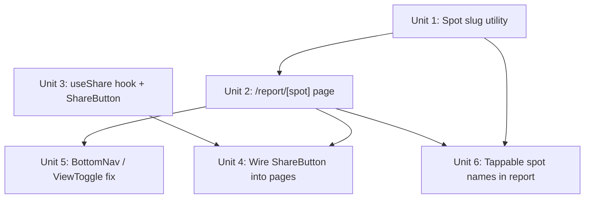

# feat: Spot report deep links and share button

## Overview

Two related features that together make Waterman forecast data shareable:

- **RAD-16** adds a `/report/[spot]` route that renders a single-spot forecast page with a stable, shareable URL.
- **RAD-17** adds a `ShareButton` component to every page that invokes the Web Share API on mobile and copies a URL to clipboard on desktop. On public forecast pages the button shares the current URL; on user-specific pages (dashboard, journal, settings, etc.) it shares the app homepage.

Together, they let a user share a direct link to any spot's forecast — or the app itself — with a single tap.

## Problem Frame

All forecast data currently lives at `/report` (all spots) or `/[sport]/[filter]` (sport-scoped, all spots). Filtering by both sport and spot requires changing your saved favourite spots — there is no transient way to look at just one spot's forecast and share it. RAD-16 creates the URL surface for a single-spot view; RAD-17 provides the share button; and a new spot-name navigation layer (R8) makes the filtered view discoverable directly from within the report.

## Requirements Trace

- R1. A URL like `/report/carcavelos` shows only the forecast for the spot matching that slug.
- R2. The URL is stable and shareable — the same URL resolves to the same spot **and the same sport** regardless of the recipient's device or local state. The share URL encodes the active sport as a `?sport=` query parameter so recipients see exactly what the sender was viewing.
- R3. Every page has a share button that invokes the native share sheet on supported mobile browsers.
- R4. On desktop or unsupported browsers, the share button copies a URL to clipboard with transient visual feedback ("Copied!").
- R7. On public forecast pages (`/report`, `/report/[spot]`, `/[sport]/[filter]`), the shared URL is the current page URL. On user-specific pages (`/dashboard`, `/journal`, `/settings`, etc.), the shared URL is the app homepage (`window.location.origin`).
- R5. Invalid slugs (no matching spot) redirect to `/report` gracefully.
- R6. `BottomNav` and `ViewToggle` correctly highlight the Report tab for all `/report/*` routes.
- R8. Spot names in the report are tappable — tapping a spot navigates to `/report/[spot]?sport=currentSport`, giving a filtered sport+spot view without requiring the user to manage favourite spots.

## Scope Boundaries

- No `slug` field added to the Convex schema — slugs are derived client-side from `spot.name` and resolved by fetching all spots.
- Every page gets a share button. Public forecast pages share their own URL; user-specific pages share the app homepage (`window.location.origin`).
- The active sport IS encoded in the share URL for `/report/[spot]` as a `?sport=` query parameter (e.g. `/report/guincho?sport=wingfoil`). The best/all condition filter is NOT encoded — that remains a local preference.
- `/[sport]/[filter]` pages (e.g. `/wing/best`) share `window.location.href` directly — sport and filter are already in the path.
- No share analytics or share-count tracking.
- No custom Open Graph image generation — text-based `generateMetadata` only.

## Context & Research

### Relevant Code and Patterns

- `app/[sport]/[filter]/page.js` — canonical model for a new dynamic report route: `useParams()`, outer `<Suspense>` + inner component, full fetch → enrich → filter → render pipeline
- `app/report/page.js` — current `/report` thin wrapper; layout and header composition reference
- `app/HomeContent.js` — full forecast data pipeline with persisted sport/filter state via `usePersistedState`
- `components/forecast/DaySection.js` — renders one day's spots and slots; receives `spotsData` map keyed by `spotId`
- `lib/slots.js` — `enrichSlots()`, `filterAndSortDays()`, `markContextualSlots()`, `markIdealSlots()`
- `convex/spots.ts` — `api.spots.getReportData` (batched fetch for all sports), `api.spots.list` (all non-webcam spots)
- `convex/schema.ts` — `spots` table: no slug field; `name` is the only human-readable identifier
- `app/subscribe/page.js:100–108` — the only existing clipboard-with-feedback pattern; `window.location.origin` idiom and `isCopied` state with 2 s reset
- `components/ui/Button.js` — use for `ShareButton` (`variant="icon"` or `variant="ghost"`)
- `components/layout/BottomNav.js:31` — active-tab regex to update
- `components/layout/Header.js` — `rightContent` injection point (used by `ViewToggle`) for desktop share button

### Institutional Learnings

- No `docs/solutions/` directory exists — no prior documented learnings for this codebase.

### External References

- [MDN: Navigator.share()](https://developer.mozilla.org/en-US/docs/Web/API/Navigator/share) — `AbortError` (user cancelled) must be caught silently; `InvalidStateError` (concurrent share) prevented by `isSharing` flag; HTTPS required in production.
- [web.dev: Web Share API](https://web.dev/articles/web-share) — feature detection, transient activation requirement (must be called from a user gesture).
- Checking `navigator.share` presence is sufficient for URL/text sharing; `navigator.canShare` not needed.
- `'use client'` directive is the primary SSR guard; additionally init `isSupported` after mount via `useEffect` to avoid hydration mismatches.

## Key Technical Decisions

- **Slug derivation without schema change**: Slugs are computed from `spot.name` via `name.toLowerCase().normalize('NFD').replace(/[\u0300-\u036f]/g, '').replace(/\s+/g, '-').replace(/[^a-z0-9-]/g, '')`. The `NFD` normalize + combining-mark strip handles accented characters (e.g. "Nazaré" → "nazare") consistently across Node.js versions. The same function is used both to generate slug links and to resolve them at runtime. If two spots produce the same slug, the first match wins — accepted given the small, admin-controlled spot list.

- **Two-phase data fetch on the spot page**: The spot page performs two sequential calls using `ConvexHttpClient` (matching the app's established `useEffect` + one-shot HTTP pattern — `useQuery` from `convex/react` is not used anywhere in the app). Phase 1: call `api.spots.list` to resolve the slug to a `targetSpot`. Phase 2: call `api.spots.getReportData` scoped to only `targetSpot.sports` (not `allSports`). This avoids the over-fetch that would occur by passing all three sports — `getReportData` loops over sports × spots internally and loading scores for irrelevant sports is non-trivial. If the spot list ever grows beyond ~30 entries, a targeted single-spot Convex query should replace this approach.

- **Query params over path segments for spot-page filters**: Sport is encoded as `?sport=wingfoil` rather than a path segment (`/report/guincho/wingfoil`) because sport is a modifier on the spot resource, not a co-equal part of its identity. `/report/guincho` is a valid standalone URL; sport is optional context with a defined fallback chain. Query params keep the route shape stable as filters are added — a future day or slot deep-link is `?sport=wingfoil&day=2026-04-06` with no route changes. Path segments would require new nested routes for each combination and make optional filters awkward to handle.

- **Sport encoding in the share URL**: The `ShareButton` on `/report/[spot]` constructs the share URL by appending the current `activeSport` as a query parameter: `/report/guincho?sport=wingfoil`. This is the URL passed to the Web Share API and copied to clipboard — not `window.location.href` directly (which only has the sport param if the user arrived via a share link, not if they navigated manually). `ShareButton` on the all-spots `/report` page shares `window.location.href` as-is (no sport to encode).

- **Spot page sport selection priority**: `/report/[spot]` uses the following priority order to determine `activeSport`, highest first:
  1. `?sport=` URL param — if present and the value is in `targetSpot.sports`, use it. This ensures share links reproduce exactly what was shared.
  2. `localStorage`-persisted sport — if compatible with the spot's supported sports.
  3. `targetSpot.sports[0]` — first supported sport as final fallback.
  The `?sport=` param is read via `useSearchParams()` and is treated as one-time initial state — it is not kept in sync with the URL as the user changes the sport toggle (to avoid cluttering the URL bar during normal browsing). `activeSport` is display-layer state only — it does not affect which data is fetched (the query is already scoped to `targetSpot.sports`). Guard against `targetSpot.sports` being `undefined` or empty: `(spot.sports?.length > 0 ? spot.sports : ['wingfoil'])`.

- **SSR metadata via Convex HTTP client**: `generateMetadata` in `/report/[spot]/page.js` resolves the slug server-side using `ConvexHttpClient` to call `api.spots.list` (a trivial `collect()` with no joins — safe for SSR). A `Promise.race` with a 3-second timeout is required; on timeout or error, fall back to a generic title. This is the first `generateMetadata` function in the app; `NEXT_PUBLIC_CONVEX_URL` is available during build/SSR. The `api.spots.list` query does not use `ctx.auth` and is publicly accessible.

- **Invalid slug → `router.push('/report')`**: When data is fully loaded and the slug matches no spot, call `router.push('/report')` (from `useRouter`). This matches every other programmatic navigation pattern in the app (`app/[sport]/[filter]/page.js` uses `router.push` throughout). Avoid `redirect()` from `next/navigation` in client components — it throws a `NEXT_REDIRECT` error caught by the nearest Suspense/error boundary rather than performing clean navigation.

- **`useShare` hook + `ShareButton` component**: Web Share API logic is encapsulated in a `'use client'` hook. `ShareButton` is a thin rendering wrapper using the existing `Button` component. Visual feedback for clipboard copy is an inline transient label change ("Copied!" for 2 s) — no toast infrastructure needed, consistent with the existing `subscribe/page.js` pattern.

- **Share button placement**: Rendered via `Header`'s `rightContent` slot on desktop. On mobile, rendered inline below the filter bar on both `/report` and `/report/[spot]`. This avoids modifying `BottomNav` for this feature.

## Open Questions

### Resolved During Planning

- **Should sport be URL-encoded on the spot page?** Yes, in the share URL only. The `ShareButton` appends `?sport=<activeSport>` when constructing the URL to share/copy. The spot page reads `?sport=` on load as the highest-priority sport selector. Normal in-page sport toggling does not update the URL — the param is one-time initial state, not a live binding. The best/all condition filter is still not encoded.
- **What renders for an invalid slug?** Redirect to `/report` (see Key Technical Decisions). Not a 404, not "NO CONDITIONS".
- **Share button on `/report` (all spots)?** Yes — it shares the generic report URL, which is still a useful shareable link.
- **Toast or inline feedback for clipboard copy?** Inline transient "Copied!" label — no toast. Consistent with the only existing clipboard pattern in the codebase.

### Deferred to Implementation

- **OnboardingModal on first visit to `/report/[spot]`**: ~~Deferred~~ **Resolved** — suppress `OnboardingModal` on `/report/[spot]`. A first-time user arriving via a share link should land directly on the forecast they were sent. Onboarding is deferred to their next visit to `/dashboard` or `/report`. Detection: if the page was reached with a `?sport=` param (indicating a share link), or simply unconditionally on all `/report/[spot]` routes — the spot page is always a share-link entry point by design.
- **Share button on `[sport]/[filter]` routes**: Now in scope — see Unit 4. These routes already encode everything in the URL so no URL construction is needed; `ShareButton` with no `url` prop is sufficient.

## High-Level Technical Design

> *This illustrates the intended approach and is directional guidance for review, not implementation specification. The implementing agent should treat it as context, not code to reproduce.*

**Slug resolution flow (RAD-16):**

```
GET /report/carcavelos
     │
     ├─ generateMetadata() [server]
     │    └─ ConvexHttpClient.query(api.spots.list)
     │         ├─ spotFromSlug(spots, "carcavelos") → found
     │         │    └─ return { title: "Carcavelos — Waterman Forecast" }
     │         └─ not found → return generic title
     │
     └─ <Suspense><SpotReportContent /></Suspense> [client]
          └─ useParams() → slug = "carcavelos"
          └─ useSearchParams() → sportParam = "wingfoil" (or null)
          └─ useEffect: ConvexHttpClient.query(api.spots.list)   [phase 1]
               ├─ loading → skeleton
               ├─ spotFromSlug(spots, slug) → null → router.push("/report")
               └─ spot found → targetSpot
                    └─ ConvexHttpClient.query(api.spots.getReportData, { sports: targetSpot.sports })  [phase 2]
                         └─ filter slots: keep only slot.spotId === targetSpot._id
                         └─ activeSport priority:
                              1. sportParam ∈ targetSpot.sports → use it
                              2. persistedSport ∈ targetSpot.sports → use it
                              3. targetSpot.sports[0] ?? 'wingfoil'
                         └─ render <DaySection> for single spot
```

**Share URL by page type:**

| Page | URL shared |
|------|-----------|
| `/report` | Current page URL |
| `/report/[spot]` | `${pathname}?sport=${activeSport}` |
| `/[sport]/[filter]` | Current page URL |
| `/dashboard`, `/journal`, `/settings`, etc. | `window.location.origin` (app homepage) |

**Share button behaviour matrix:**

| Context | `navigator.share` available | Action | Feedback |
|---|---|---|---|
| Mobile / supported browser | Yes | Native share sheet `{ title, url }` | Sheet opens; no extra UI |
| Desktop / Firefox | No | `navigator.clipboard.writeText(url)` | "Copied!" label for 2 s |
| Clipboard also unavailable | No | No feedback — silent no-op | No state change |
| User cancels share (AbortError) | Yes | Catch silently | No state change |
| Concurrent share already open | Yes | Button disabled (`isSharing`) | Button stays disabled |

## Implementation Units



---

- [ ] **Unit 1: Spot slug utility**

**Goal:** A single, canonical slug derivation and reverse-lookup function used consistently across link generation, URL resolution, and `generateMetadata`.

**Requirements:** R1, R2

**Dependencies:** None

**Files:**
- Create: `lib/spotSlug.js`
- Test: `lib/__tests__/spotSlug.test.js`

**Approach:**
- Export `toSpotSlug(name)` — normalizes a spot name to a URL-safe slug: NFD unicode normalize, strip combining diacritical marks, lowercase, collapse whitespace to hyphens, strip non-alphanumeric characters (except hyphens).
- Export `spotFromSlug(spots, slug)` — finds the first spot in an array where `toSpotSlug(spot.name) === slug`. Returns `null` if not found.
- Both functions are pure with no React or Convex dependencies.

**Patterns to follow:**
- `lib/slots.js` — pure utility function module style (no React, no Convex imports)

**Test scenarios:**
- Happy path: `toSpotSlug("Carcavelos")` → `"carcavelos"`
- Happy path: `toSpotSlug("Costa do Estoril")` → `"costa-do-estoril"`
- Edge case: `toSpotSlug("Nazaré")` → `"nazare"` (accented character stripped via NFD normalization)
- Edge case: `toSpotSlug("Praia D'El Rey")` → `"praia-del-rey"` (apostrophe stripped)
- Edge case: `toSpotSlug("  Spot Name  ")` → `"spot-name"` (leading/trailing whitespace collapsed)
- Edge case: `toSpotSlug("")` → `""` (empty string returns empty string without throwing)
- Happy path: `spotFromSlug([{ name: "Carcavelos" }], "carcavelos")` returns the correct spot object
- Edge case: `spotFromSlug(spots, "nonexistent")` returns `null`
- Edge case: `spotFromSlug([], "carcavelos")` returns `null`

**Verification:**
- All test scenarios pass.
- `toSpotSlug` and `spotFromSlug` are importable from `lib/spotSlug.js` with no side effects.

---

- [ ] **Unit 2: `/report/[spot]` route page**

**Goal:** A new Next.js App Router page at `app/report/[spot]/page.js` that renders a single-spot filtered forecast with dynamic metadata for link previews.

**Requirements:** R1, R2, R5

**Dependencies:** Unit 1

**Files:**
- Create: `app/report/[spot]/page.js`
- Test: `app/report/[spot]/__tests__/page.test.js`

**Approach:**
- Follow `app/[sport]/[filter]/page.js` structurally: an outer export default that wraps an inner `SpotReportContent` component in `<Suspense>`.
- `generateMetadata({ params })`: instantiate `ConvexHttpClient`, race `api.spots.list` against a 3-second timeout; call `spotFromSlug()` to find the spot; return `{ title: "${spotName} — Waterman Forecast" }` on match, `{ title: "Waterman Forecast" }` on timeout/error/no match. This is the first `generateMetadata` in the app — the file must export both `generateMetadata` and a default server component that wraps the `'use client'` inner component.
- `SpotReportContent` (inner `'use client'` component, follows the `Suspense`-inner-component pattern from `[sport]/[filter]/page.js`):
  1. Read `slug` from `useParams()` and `sportParam` from `useSearchParams()`.
  2. **Phase 1** — `useEffect`: call `ConvexHttpClient.query(api.spots.list)`. Track resolution as `resolvedSpot: 'loading' | 'not-found' | SpotObject` — never redirect while `'loading'`. On load, call `spotFromSlug()`.
  3. If `resolvedSpot === 'not-found'`: call `router.push('/report')` (not `redirect()` — see Key Technical Decisions).
  4. **Phase 2** — after `targetSpot` is resolved: call `ConvexHttpClient.query(api.spots.getReportData, { sports: targetSpot.sports ?? ['wingfoil'] })`. This scopes the query to only the spot's supported sports, avoiding the over-fetch of all three sports' score data.
  5. Filter the enriched slot pipeline to only slots where `slot.spotId === targetSpot._id`.
  6. Determine `activeSport` using priority order: (1) `sportParam` if present and in `targetSpot.sports`; (2) localStorage-persisted sport if in `targetSpot.sports`; (3) `targetSpot.sports?.[0] ?? 'wingfoil'`. `activeSport` is display-layer state only — does not affect the query. Note: `activeSport` is one-time initial state from `sportParam`; changing the sport toggle in-page does not update the URL.
  7. Render `<MainLayout>` → `<Header>` → day sections for the single spot only.
  8. Do NOT show `OnboardingModal` on this page — suppress it unconditionally. Users arriving via a share link should see the forecast immediately; onboarding will surface on their next visit to `/dashboard` or `/report`.

**Patterns to follow:**
- `app/[sport]/[filter]/page.js` — full structural reference: `Suspense` wrapper, `useParams`, enrichment pipeline order
- `app/report/page.js` — layout, header composition, and `MainLayout` usage
- `lib/slots.js` — enrichment + filtering pipeline sequence

**Test scenarios:**
- Happy path: valid slug resolves to a spot → page renders only that spot's `DaySection`(s), not other spots
- Happy path: `generateMetadata` with valid slug → returns `{ title: "Carcavelos — Waterman Forecast" }`
- Happy path: `generateMetadata` with invalid slug → returns generic title without throwing
- Error path: data loaded, slug matches no spot → `router.push("/report")` is called (not `redirect()`)
- Edge case: spot exists but all slots are filtered out (no good conditions) → `EmptyState` renders ("NO CONDITIONS"), not a redirect
- Edge case: `?sport=wingfoil` present and valid for the spot → `activeSport` is `wingfoil` regardless of localStorage
- Edge case: `?sport=kitesurfing` present but spot doesn't support kitesurfing → param is ignored, falls through to localStorage then `sports[0]`
- Edge case: no `?sport=` param, persisted sport not in `targetSpot.sports` → `activeSport` falls back to `targetSpot.sports[0]`
- Edge case: `targetSpot.sports` is `undefined` or empty → `activeSport` falls back to `'wingfoil'` (same defensive fallback as `getReportData`)
- Integration: navigating directly to `/report/carcavelos` in a browser renders the filtered single-spot view

**Verification:**
- `/report/carcavelos` shows only Carcavelos day sections.
- Browser tab title and link-preview metadata reads "Carcavelos — Waterman Forecast".
- `/report/nonexistent` redirects to `/report` without an error screen.
- BottomNav highlights the Report tab (after Unit 5).

---

- [ ] **Unit 3: `useShare` hook and `ShareButton` component**

**Goal:** Encapsulate Web Share API logic in a reusable, SSR-safe hook; expose a ready-to-use `ShareButton` UI component that consumes it.

**Requirements:** R3, R4

**Dependencies:** None

**Files:**
- Create: `hooks/useShare.js`
- Create: `components/ui/ShareButton.js`
- Test: `hooks/__tests__/useShare.test.js`

**Approach:**
- `hooks/useShare.js` (`'use client'`):
  - Computes `isSupported` after mount via `useEffect` (not at render time) to avoid SSR hydration mismatches. Default value before mount: `false`.
  - Exposes `share(data)` async function:
    - If `navigator.share` is available: call and await it. Catch `AbortError` silently (user cancelled). Log other error types (`NotAllowedError`, `InvalidStateError`, etc.) without surfacing them to UI.
    - Fallback: call `navigator.clipboard.writeText(data.url)`. Catch errors silently.
    - On successful clipboard write: set `isCopied = true`, reset after 2 s using `setTimeout` with the timer ID held in a `useRef` to avoid stale-closure bugs and clean up on unmount.
  - Manages `isSharing` boolean: set true before `navigator.share` call, false after resolution or rejection — prevents concurrent invocations.
- `components/ui/ShareButton.js` (`'use client'`):
  - Accepts optional `url` prop (defaults to `typeof window !== 'undefined' ? window.location.href : ''`) and optional `title` prop.
  - Uses `useShare()` internally.
  - Renders `<Button variant="icon" ...>` with the `Share2` Lucide icon.
  - When `isCopied` is true, replaces the `Share2` icon with a "Copied!" text label (icon is hidden during this state).
  - Disabled while `isSharing` is true.

**Patterns to follow:**
- `app/subscribe/page.js:100–108` — `isCopied` state, `setTimeout` reset, `window.location.origin` idiom
- `components/ui/Button.js` — `variant="icon"`, Lucide icon prop usage

**Test scenarios:**
- Happy path: `share()` called when `navigator.share` is available → `navigator.share` is invoked with `{ title, url }`
- Happy path: `share()` called when `navigator.share` is absent → `navigator.clipboard.writeText` is called with the URL; `isCopied` becomes true
- Edge case: user cancels share (AbortError thrown) → `isCopied` stays false; no error is surfaced
- Error path: clipboard write throws → error is caught silently; `isCopied` stays false
- Edge case: `share()` called while `isSharing` is true → second call is a no-op (concurrent guard)
- Edge case: `isCopied` resets to false after ~2 s
- Edge case: component unmounts before the 2 s reset fires → timeout is cleared, no setState-on-unmounted warning
- Integration: `ShareButton` renders with `Share2` icon; shows "Copied!" label transiently after a clipboard copy

**Verification:**
- On mobile (or with `navigator.share` mocked as present), tapping the button invokes the native share sheet.
- On desktop (no `navigator.share`), tapping the button copies the URL; label changes to "Copied!" for ~2 s then resets.
- Button is disabled during an active share.
- No SSR errors — component renders without accessing `window` or `navigator` during server render.

---

- [ ] **Unit 4: Wire `ShareButton` into report pages**

**Goal:** Add `ShareButton` to every page. Public forecast pages share their own URL; user-specific pages share the app homepage.

**Requirements:** R3, R4, R7

**Dependencies:** Unit 2, Unit 3

**Files:**
- Modify: `app/report/page.js` (or `app/HomeContent.js`)
- Modify: `app/report/[spot]/page.js`
- Modify: `app/[sport]/[filter]/page.js`
- Modify: `app/dashboard/page.js`
- Modify: `app/journal/page.js` and `app/journal/[id]/page.js`
- Modify: any remaining pages not covered above (settings, calendar, cams, etc.)
- Modify: `components/layout/Header.js` if the `rightContent` slot needs to be exposed or extended

**URL logic by page type:**

| Page | Share URL |
|------|-----------|
| `/report` | `window.location.href` |
| `/report/[spot]` | `${pathname}?sport=${activeSport}` (explicitly constructed) |
| `/[sport]/[filter]` | `window.location.href` (sport + filter already in path) |
| `/dashboard`, `/journal`, `/settings`, `/calendar`, `/cams`, etc. | `window.location.origin` (app homepage) |

**Approach:**
- The simplest implementation: `ShareButton` accepts an optional `url` prop. The `MainLayout` or `Header` renders `ShareButton` app-wide with no `url` prop by default (falls back to `window.location.href`). Pages that need homepage sharing pass `url={window.location.origin}` explicitly. `/report/[spot]` passes the sport-scoped URL explicitly.
- User-specific pages pass `url={window.location.origin}` — this is the only deviation from the default.
- Placement is consistent across all pages: desktop via `Header`'s nav area, mobile inline below the page's primary filter/header area.
- Verify whether `Header` already accepts a `rightContent` prop (per research: `ViewToggle` uses it). If so, add `ShareButton` next to the existing `rightContent` content without breaking layout. If `rightContent` needs extending to accept multiple children, make the minimal change.
- `ShareButton` is a `'use client'` component — its parent page file can remain a server component; the boundary is at the component itself.

**Test expectation: none** — this unit is composition/wiring only. Behavioral coverage is owned by Unit 3's `useShare` tests. Integration verified manually below.

**Patterns to follow:**
- How `ViewToggle` passes `rightContent` into `Header`
- `app/[sport]/[filter]/page.js` — how header props are composed in a dynamic report page

**Verification:**
- `ShareButton` is visible on every page.
- Tapping on `/report/carcavelos` shares `/report/carcavelos?sport=wingfoil`.
- Tapping on `/wing/best` shares `/wing/best`.
- Tapping on `/dashboard`, `/journal`, or other user-specific pages shares `window.location.origin`.
- No layout shift or overflow in the header on narrow screen widths.

---

- [ ] **Unit 5: BottomNav and ViewToggle active-state fix**

**Goal:** Ensure the Report tab is correctly highlighted in `BottomNav` and `ViewToggle` for any `/report/*` sub-route, not just `/report` exactly.

**Requirements:** R6

**Dependencies:** Unit 2 (the new route must exist to validate the fix end-to-end)

**Files:**
- Modify: `components/layout/BottomNav.js`
- Modify: `components/layout/ViewToggle.js` (conditional — audit first)
- Test: `components/layout/__tests__/BottomNav.test.js`

**Approach:**
- In `BottomNav` (around line 31): change the `/report` exact-match condition to `pathname === '/report' || pathname.startsWith('/report/')`. Use the explicit two-condition form (not just `startsWith('/report')`) to avoid a hypothetical future `/reporter` route being caught as a false positive.
- In `ViewToggle`: **audit before modifying**. The existing `isReport` logic uses a negative-match fallback (active when path is not dashboard, not calendar, not cams, not journal, not ui-kit) — this fallback already catches `/report/carcavelos` correctly. If so, no change is needed. If a strict equality check is found, expand it. Either way, add an explicit `pathname.startsWith('/report/')` condition for future resilience and document the outcome.
- No changes to tab icons, navigation actions, or any other BottomNav behavior.

**Patterns to follow:**
- Existing `pathname.startsWith` or `pathname.match` patterns already in `BottomNav.js`

**Test scenarios:**
- Happy path: `pathname = "/report"` → active tab is "report"
- Happy path: `pathname = "/report/carcavelos"` → active tab is "report"
- Happy path: `pathname = "/report/costa-do-estoril"` → active tab is "report"
- Happy path: `pathname = "/dashboard"` → active tab is "home" (unchanged)
- Happy path: `pathname = "/wing/best"` → active tab is the wing/sport tab (unchanged)
- Edge case: `pathname = "/reporter"` (hypothetical) → does NOT match "report" tab

**Verification:**
- Navigating to `/report/carcavelos` highlights the Report tab in `BottomNav`.
- All previously correct tab-selection behaviors remain unchanged.

---

- [ ] **Unit 6: Tappable spot names in report**

**Goal:** Make spot names in `DaySection` tappable so users can drill from the multi-spot report directly into a single-spot filtered view, without touching favourite spot settings.

**Requirements:** R8

**Dependencies:** Unit 1 (slug generation), Unit 2 (destination route must exist)

**Files:**
- Modify: `components/forecast/DaySection.js`
- Test: `components/forecast/__tests__/DaySection.test.js`

**Approach:**
- In `DaySection`, the spot name heading (currently plain text or a static element) becomes a `<button>` or `<Link>` that navigates to `/report/${toSpotSlug(spot.name)}?sport=${activeSport}`.
- Use Next.js `<Link>` for prefetching behaviour — not `router.push` — since the target is a known route.
- The spot name should have a subtle affordance (underline on hover/focus, or a small link icon) to signal it is tappable without visually cluttering the forecast row.
- `activeSport` is passed down from the parent page (it is already available in `HomeContent` and `[sport]/[filter]/page.js` as the current sport selection). `DaySection` receives it as a prop and uses it to construct the link.
- On `/report/[spot]` (single-spot view), the spot name heading is NOT a link — there is nowhere further to drill down to.

**Patterns to follow:**
- `lib/spotSlug.js` (`toSpotSlug`) — already imported for link construction
- `components/forecast/DaySection.js` — existing spot name rendering to wrap

**Test scenarios:**
- Happy path: spot name renders as a `<Link>` with `href="/report/carcavelos?sport=wingfoil"` when `activeSport="wingfoil"` and spot name is "Carcavelos"
- Happy path: slug is correctly derived for accented names (e.g. "Nazaré" → `"nazare"`)
- Edge case: on `/report/[spot]` (single-spot view), spot name is NOT a link
- Edge case: `activeSport` is `undefined` — link omits the `?sport=` param rather than appending `?sport=undefined`

**Verification:**
- Tapping a spot name in `/report` or `/wing/best` navigates to the correct `/report/[spot]?sport=` URL.
- Spot link is keyboard-focusable and has a visible focus state.
- On `/report/[spot]`, the spot name is not a link.

---

## System-Wide Impact

- **Interaction graph:** `BottomNav` and `ViewToggle` are rendered on every page via `MainLayout` — the active-tab regex change in Unit 5 affects active-tab display globally. `Header`'s `rightContent` slot is used by the share button alongside any existing controls (e.g., `ViewToggle`).
- **Error propagation:** Invalid slugs trigger `router.push('/report')` in the client component — no unhandled errors bubble to the layout shell. `useShare` catches `AbortError` silently; other share errors are logged but not surfaced in UI. `generateMetadata` wraps its Convex call in a `Promise.race` timeout and returns generic metadata on any failure — never throws.
- **State lifecycle risks:** `isCopied` timer cleanup — if `ShareButton` unmounts before the 2 s timeout fires, a `useEffect` cleanup calling `clearTimeout` prevents setState-on-unmounted warnings. Covered in Unit 3.
- **API surface parity:** `ShareButton` on `/report/[spot]` receives an explicit `url` prop with `?sport=` appended — callers are responsible for constructing the sport-scoped URL. `ShareButton` on `/report` (all-spots) uses `window.location.href` as the default, which carries no sport param. The `url` prop is optional; when omitted, `window.location.href` is used as a safe fallback.
- **Integration coverage:** `toSpotSlug` must produce identical results whether called server-side in `generateMetadata` (Node.js) or client-side in `SpotReportContent` (browser). Unit 1 tests validate this determinism; NFD normalization is consistent across both environments.
- **`DaySection` receives a new prop:** `activeSport` must be threaded down from every parent that renders `DaySection` (`HomeContent`, `[sport]/[filter]/page.js`, `report/[spot]/page.js`). On the spot page, spot names are rendered as plain text; on all other report pages, they are `<Link>` elements. This is a prop addition to an existing component — no change to rendering logic.
- **Unchanged invariants:** `/report` (all-spots view), `/[sport]/[filter]`, `/dashboard`, and all other existing routes are not modified in behavior. The BottomNav change is additive (extends a condition, does not replace any existing behavior).

## Risks & Dependencies

| Risk | Mitigation |
|------|------------|
| Slug collision between two spot names | Accepted — spot list is admin-controlled and small; first-match-wins documented in code; revisit if list exceeds ~30 spots |
| `getReportData` over-fetch if `allSports` were passed | Mitigated by two-phase fetch: phase 1 resolves `targetSpot`, phase 2 passes only `targetSpot.sports` to `getReportData` |
| `generateMetadata` hanging on slow Convex response | `Promise.race` with 3-second timeout is required (not optional); returns generic title on timeout |
| `targetSpot.sports` undefined or empty → crash on `sports[0]` | Explicit guard: `(spot.sports?.length > 0 ? spot.sports : ['wingfoil'])` mirrors `getReportData`'s existing defensive fallback |
| `redirect()` in client component caught by error boundary | Use `router.push('/report')` instead — consistent with all existing programmatic navigation in the app |
| Accented characters in spot names produce inconsistent slugs | NFD normalization + combining-mark strip is deterministic across Node.js and browsers; covered by Unit 1 tests |
| Web Share API absent on HTTP staging environments | Note in developer setup docs that share testing requires HTTPS or localhost |
| `useShare` `isCopied` timer leaking on unmount | `useEffect` cleanup calls `clearTimeout`; covered by Unit 3 test scenario |
| `pathname.startsWith('/report/')` catching an unintended future route | Two-condition form `=== '/report' \|\| startsWith('/report/')` is explicit; new routes under `/report/` belong to the Report tab by design |
| `?sport=` param in URL reflects stale sport after user changes sport toggle | Accepted — `?sport=` is one-time initial state only; changing the toggle in-page does not update the URL. The URL remains accurate for the shared moment; subsequent navigation is the user's own state. |
| `?sport=` param value not in `targetSpot.sports` (e.g. corrupted or manually edited URL) | Param is validated against `targetSpot.sports` before use; invalid value is silently ignored and falls through to localStorage → `sports[0]` priority chain |

## Sources & References

- Related issues: RAD-16, RAD-17
- Closest route structural reference: `app/[sport]/[filter]/page.js`
- Clipboard + feedback pattern reference: `app/subscribe/page.js:100–108`
- MDN Web Share API: https://developer.mozilla.org/en-US/docs/Web/API/Navigator/share
- web.dev Web Share guide: https://web.dev/articles/web-share
