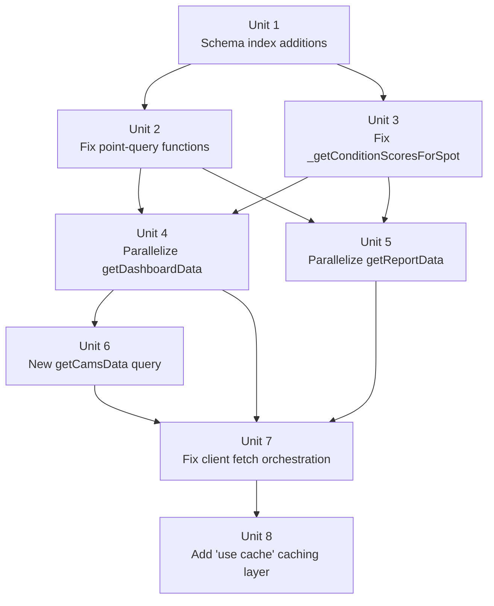

# fix: Eliminate Slow Page Loads on Dashboard, Report, and Cams Pages

## Overview

The Dashboard, Report, and Cams pages load slowly due to a compounding set of database-layer and client-side architectural problems: missing indexes causing full table scans, N+1 sequential query loops inside Convex functions, unbounded query growth as the database ages, sequential client-side round-trips before data can be fetched, and zero caching for data that changes at most four times per day. This plan addresses all layers of the stack — schema, query functions, client orchestration, and caching — in dependency order.

## Problem Frame

The application scrapes weather data four times per day and stores forecast slots, condition scores, and tides in Convex. The three heaviest pages each trigger multiple Convex HTTP queries from the client after hydration. The root causes are:

1. **Missing index on `spotConfigs`** — every config lookup is a full table scan called N×M times per page load (spots × sports).
2. **Wrong field order on `condition_scores` index (`by_spot_timestamp_sport`)** — sport filtering happens in JavaScript after reading all sports' scores, multiplying document reads by the number of sports per spot.
3. **N+1 sequential loops** in `getDashboardData` and `getReportData` — for each spot the handler awaits config, slots, scores, and tides in series instead of in parallel.
4. **Full table scan on `scrapes`** — `getMostRecentScrapeTimestamp` collects every scrape record to find the max timestamp; no global timestamp index exists.
5. **Unbounded `getConditionScores`** — no timestamp cutoff; the query reads the entire score history, growing linearly with database age (4 scrapes/day × 365 days = 1,460+ scrape timestamps per spot per sport).
6. **`getTides` ignores the `by_spot_time` range index** — all tides for a spot are collected and then filtered in JavaScript even though a time-range index exists.
7. **Sequential client-side round-trips** — Dashboard and Cams both call a `list*` query and await it before calling the batched data query; the second call cannot start until the first completes.
8. **`[sport]/[filter]/page.js` legacy fetch pattern** — fires individual per-spot queries in O(N×M) fan-out instead of using the existing `getReportData` batch query.
9. **No caching** — every navigation triggers cold Convex HTTP queries even though underlying data changes at most every six hours.
10. **Client-side data fetching via `useEffect`** — all three pages are `"use client"` components that fetch after hydration, forcing a blank render → hydrate → fetch → render waterfall on every visit.

## Requirements Trace

**Schema & Query Layer**
- R1. Eliminate N+1 sequential query patterns within Convex query handlers.
- R2. Add missing indexes and fix index field ordering to eliminate full table scans.
- R3. Add timestamp bounds to all score and scrape queries to prevent unbounded growth.

**Client & Server Orchestration**
- R4. Merge sequential client-side round-trips into single Convex calls where possible.
- R5. Migrate `[sport]/[filter]/page.js` to the existing batch query.

**Caching & Data Freshness**
- R6. Add a caching layer matching the data's six-hour update cadence.

**Frontend Architecture**
- R7. Move data fetching ahead of hydration to eliminate the blank-page waterfall on Dashboard, Report, and Cams.

## Scope Boundaries

- This plan does not change the scraping cadence, scoring logic, or LLM integration.
- This plan does not redesign the Convex schema beyond index additions and field reordering within `condition_scores`.
- Horizontal / multi-instance deployment (shared Redis cache handler for `"use cache"`) is out of scope; the app runs as a single Render Node process.
- No new UI features or behavior changes — only performance improvements.
- Real-time WebSocket subscriptions (`useQuery`) are not introduced; the HTTP client pattern is preserved and cached at the Next.js layer instead.

## Context & Research

### Relevant Code and Patterns

- `convex/schema.ts` — all table definitions and indexes; source of truth for index additions
- `convex/spots.ts:1901–1963` — `_getForecastSlotsForSpot` (inner sequential reads per spot)
- `convex/spots.ts:1970–2017` — `_getConditionScoresForSpot` (over-broad index, in-memory sport filter)
- `convex/spots.ts:1496–1559` — `getConditionScores` (missing timestamp cutoff, unbounded)
- `convex/spots.ts:2027–2073` — `getDashboardData` (sequential N+1 loop over spots)
- `convex/spots.ts:2081–2145` — `getReportData` (sequential N+1 loop, inlined scrape-scan)
- `convex/spots.ts:130–146` — `getSpotConfig` (full table scan using `.filter()` on `spotConfigs`)
- `convex/spots.ts:441–459` — `getMostRecentScrapeTimestamp` (full table scan on `scrapes`)
- `convex/spots.ts:299–324` — `getTides` (collects all tides, range-filters in JavaScript)
- `app/dashboard/page.js:54–114` — sequential `spots.list` then `getDashboardData` round-trips
- `app/cams/page.js:54–74` — sequential `listWebcams` then `getDashboardData` round-trips
- `app/[sport]/[filter]/page.js:120–207` — legacy un-batched per-spot O(N×M) fetch fan-out
- `app/HomeContent.js` — reference implementation using `getReportData` (the pattern to replicate); `app/report/page.js` is its RSC shell wrapper with no data fetching

### External References

- [Convex Indexes and Query Performance](https://docs.convex.dev/database/reading-data/indexes/indexes-and-query-perf) — index field ordering, selectivity rules, `withIndex` vs `.filter()` implications
- [Convex Best Practices](https://docs.convex.dev/understanding/best-practices/) — `Promise.all` / `asyncMap` within a single query handler; `Date.now()` determinism caution
- [convex-helpers relationship helpers](https://stack.convex.dev/functional-relationships-helpers) — `asyncMap`, `getAll`, `getManyFrom` primitives for N+1 elimination
- [Next.js 16 `"use cache"` directive](https://nextjs.org/blog/composable-caching) — function-level caching with `cacheLife` and `cacheTag` replacing `unstable_cache`
- [Next.js `cacheComponents` config](https://nextjs.org/docs/app/api-reference/config/next-config-js/cacheComponents) — opt-in flag required to activate `"use cache"`

## Key Technical Decisions

- **Use `asyncMap` from `convex-helpers` (not raw `Promise.all`) inside Convex handlers:** `asyncMap` is the idiomatic Convex pattern for parallel reads within a single transaction. All `ctx.db` operations fired via `asyncMap` share the same snapshot-isolated transaction, making them safe. It requires adding `convex-helpers` as a dependency.

- **Reorder `condition_scores` index fields from `["spotId", "timestamp", "sport"]` to `["spotId", "sport", "timestamp"]`:** With the current order, sport cannot be pushed down to the index; it must be applied as an in-memory `.filter()` after reading all sports' scores. With `["spotId", "sport", "timestamp"]`, the query can use `.eq("spotId").eq("sport").gte("timestamp", cutoff)` for full server-side filtering, reducing document reads by a factor equal to the number of sports per spot. This is a **Convex schema migration**: the old index must be removed and the new one added. Convex handles index builds automatically on deploy; there is a brief build window where both are present.

- **Add a new `getCamsData` Convex query instead of reusing `getDashboardData`:** Cams needs webcam-only spots plus their condition data. Rather than pushing spot-filtering logic to the client (current pattern: `listWebcams` → client filters → `getDashboardData`), a new `getCamsData` query performs the `isWebcam` filter server-side and returns spots + data in one call. This mirrors how `getReportData` already handles spot filtering for the Report page.

- **Add Next.js `"use cache"` with `cacheLife('minutes')` rather than converting pages to Server Components:** Full Server Component conversion would require restructuring all three pages and their child component trees. `"use cache"` wrapping individual Convex HTTP client calls achieves the caching benefit with far smaller blast radius — only the data-fetching utility functions change, not the page architecture. The `"use client"` → Server Component migration is deferred to a future refactor (R7 partial deferral).

- **Scope timestamp cutoff for `getConditionScores` to 7 days:** Matches the cutoff already used by `_getConditionScoresForSpot` internally. Provides a consistent data window across all query surfaces and prevents unbounded growth as the database ages.

- **Do not introduce `Date.now()` inside Convex query handlers for cutoff calculation:** Convex requires query handlers to be deterministic. `Date.now()` inside a handler causes frequent cache invalidation. Instead, pass the cutoff timestamp as an argument from the client (computed immediately before the HTTP call) or use a stable computed value derived from arguments already passed.

## Open Questions

### Resolved During Planning

- **Should `condition_scores` index reorder be a breaking migration?** No. Convex builds new indexes automatically on deploy without downtime. The old index name must be removed from schema and all `withIndex("by_spot_timestamp_sport", ...)` call sites updated simultaneously. Both old and new indexes coexist briefly during the build window; queries using the old name will fail if deployed before the index is built (Convex enforces this at deploy time, not runtime — so the deploy itself is the gate).

- **Should `getMostRecentScrapeTimestamp` use a compound `["isSuccessful", "scrapeTimestamp"]` index or just `["scrapeTimestamp"]`?** Use `["isSuccessful", "scrapeTimestamp"]` so the index can filter to `isSuccessful = true` at the index level and then `.order("desc").first()` to get the max. A plain `["scrapeTimestamp"]` index would still require collecting all scrapes or filtering `isSuccessful` in JavaScript after the indexed read. The compound index eliminates both the full scan and the in-memory filter.

- **Can `_getForecastSlotsForSpot`'s two sequential reads be parallelized?** Yes — both reads are `ctx.db.query()` calls on different indexes of the same table with no data dependency between them. They can be wrapped in `Promise.all`.

### Deferred to Implementation

- **Exact `cacheTag` key strategy for `"use cache"` invalidation:** Whether to tag by sport, by spot, or by scrape timestamp depends on how finely the implementer wants to invalidate on scrape completion. Decide during implementation based on what data the scraper writes and what hook is available post-scrape.

- **Whether to add a `revalidateTag` call at the end of the scraper script:** The scraper (`scripts/scrape.mjs`) runs as a Render cron. If it can call a Next.js cache invalidation endpoint after completing, cache TTLs can be set longer (matching the 6-hour scrape interval). Otherwise, set `cacheLife` conservatively at ~5 minutes. Assess during implementation.

- **Whether `convex-helpers` version constraint is compatible with current Convex 1.30:** Verify `package.json` peer dependency ranges before installing.

## High-Level Technical Design

> *This illustrates the intended approach and is directional guidance for review, not implementation specification. The implementing agent should treat it as context, not code to reproduce.*

### Query Function Parallelism Pattern (Units 3–5)

```
// BEFORE: Sequential — each await blocks the next
for (const spot of spots) {
  const slots  = await _getForecastSlotsForSpot(ctx, spot._id)   // blocks
  const config = await ctx.db.query("spotConfigs").filter(...).first()  // blocks
  const scores = await _getConditionScoresForSpot(ctx, spot._id, sport) // blocks
  const tides  = await ctx.db.query("tides").filter(...).collect()       // blocks
}

// AFTER: Parallel — all reads for a spot fire simultaneously
await asyncMap(spots, async (spot) => {
  const [slots, config, scores, tides] = await Promise.all([
    _getForecastSlotsForSpot(ctx, spot._id),
    ctx.db.query("spotConfigs").withIndex("by_spot_sport", ...).first(),
    _getConditionScoresForSpot(ctx, spot._id, sport, cutoffTimestamp),
    ctx.db.query("tides").withIndex("by_spot_time", ...).collect(),
  ])
  // combine and return
})
```

### Index Selectivity After Fixes (Unit 1)

```
BEFORE → AFTER

spotConfigs (no index)
  ctx.db.query("spotConfigs").filter(q => q.and(...))
  Cost: full table scan × N×M per page load
  →
  .index("by_spot_sport", ["spotId", "sport"])
  ctx.db.query("spotConfigs").withIndex("by_spot_sport", q => q.eq("spotId").eq("sport")).first()
  Cost: single indexed point lookup

condition_scores .index("by_spot_timestamp_sport", ["spotId", "timestamp", "sport"])
  .withIndex(..., q => q.eq("spotId").gte("timestamp"))  — sport filtered in JS
  Cost: reads ALL sports' scores, discards N-1/N
  →
  .index("by_spot_sport_timestamp", ["spotId", "sport", "timestamp"])
  .withIndex(..., q => q.eq("spotId").eq("sport").gte("timestamp", cutoff))
  Cost: reads only the requested sport's scores within the cutoff window

scrapes (no global timestamp index)
  ctx.db.query("scrapes").collect() → JS filter + Math.max
  Cost: full table scan on every page load
  →
  .index("by_success_timestamp", ["isSuccessful", "scrapeTimestamp"])
  .withIndex(..., q => q.eq("isSuccessful", true)).order("desc").first()
  Cost: single indexed lookup
```

### Client-Side Round-Trip Reduction (Units 6–7)

```
BEFORE (Dashboard):
  await client.query(api.spots.list, {})        // RT 1 — blocks
  → client-side filter → spotIds
  await Promise.all([
    client.query(api.spots.getDashboardData, { spotIds, ... }),  // RT 2
    client.query(api.spots.getMostRecentScrapeTimestamp),        // RT 2 parallel
  ])
  Total: 2 sequential round-trips

AFTER (Dashboard):
  await Promise.all([
    client.query(api.spots.getDashboardData, { sports, userId }),  // RT 1: server-filters spots
    client.query(api.spots.getMostRecentScrapeTimestamp),          // RT 1 parallel
  ])
  Total: 1 round-trip

BEFORE (Cams):
  await client.query(api.spots.listWebcams, { sports })     // RT 1 — blocks
  → client-side map → spotIds
  await client.query(api.spots.getDashboardData, { ... })   // RT 2
  Total: 2 sequential round-trips

AFTER (Cams):
  await client.query(api.spots.getCamsData, { sports, userId })  // RT 1: new server-batched query
  Total: 1 round-trip
```

## Implementation Units



---

- [ ] **Unit 1: Schema Index Additions and Fixes**

**Goal:** Add missing indexes and fix the `condition_scores` index field order so all subsequent query fixes have the correct index infrastructure available at deploy time.

**Requirements:** R2

**Dependencies:** None

**Files:**
- Modify: `convex/schema.ts`

**Approach:**
- Add `.index("by_spot_sport", ["spotId", "sport"])` to the `spotConfigs` table definition.
- Remove the existing `by_spot_timestamp_sport` index from `condition_scores` and add `.index("by_spot_sport_timestamp", ["spotId", "sport", "timestamp"])`. Update the index name throughout the codebase — the name change forces all call sites to be updated in the same deploy.
- Add `.index("by_success_timestamp", ["isSuccessful", "scrapeTimestamp"])` to the `scrapes` table for the global most-recent scrape lookup.
- Verify the `tides` table already has `.index("by_spot_time", ["spotId", "time"])` — if present, no schema change needed for tides; the fix is in the query function (Unit 2).
- This unit is deployed first; Convex will build the new indexes before serving traffic on them. All Unit 2–5 call sites that reference the old `condition_scores` index name must be updated in the same commit.

**Patterns to follow:**
- `convex/schema.ts` existing index call patterns (`.index("name", ["field1", "field2"])`)

**Test scenarios:**
- Happy path: deploy succeeds; Convex dashboard shows all new indexes in "Ready" state; existing queries that do not touch renamed indexes continue to function.
- Integration: verify the `condition_scores` index rename does not break any TypeScript types at compile time (Convex generates types from schema).

**Verification:**
- `convex dev` compiles without type errors after the schema change.
- All indexes appear as "Ready" in the Convex dashboard or via `convex deploy --dry-run`.

---

- [ ] **Unit 2: Fix Point-Query Functions Using New Indexes**

**Goal:** Update `getSpotConfig`, `getMostRecentScrapeTimestamp`, and `getTides` to use indexed lookups instead of full table scans and in-memory range filters. Add a timestamp cutoff to `getConditionScores`.

**Requirements:** R2, R3

**Dependencies:** Unit 1 (indexes must exist before `withIndex` calls are added)

**Files:**
- Modify: `convex/spots.ts` (lines 130–146 `getSpotConfig`, 441–459 `getMostRecentScrapeTimestamp`, 299–324 `getTides`, 1496–1559 `getConditionScores`)
- Test: `convex/spots.test.ts` (create if absent)

**Approach:**
- **`getSpotConfig` (line 130):** Replace `.filter(q => q.and(q.eq("spotId", ...), q.eq("sport", ...)))` with `.withIndex("by_spot_sport", q => q.eq("spotId", args.spotId).eq("sport", args.sport)).first()`. No logic change — same returned document.
- **`getMostRecentScrapeTimestamp` (line 441):** Replace `.collect()` + JS `Math.max` with `.withIndex("by_success_timestamp", q => q.eq("isSuccessful", true)).order("desc").first()`. The result is the document with the highest `scrapeTimestamp`; return `result?.scrapeTimestamp ?? null`.
- **`getTides` (line 299):** When `startTime` and/or `endTime` args are provided, switch to `.withIndex("by_spot_time", q => q.eq("spotId", args.spotId).gte("time", args.startTime))` and apply the `endTime` upper bound with `.filter()` (a single post-index filter on an already-narrow result set is acceptable). When neither bound is provided, the existing `by_spot` index path is fine.
- **`getConditionScores` (line 1496):** Add a `cutoffTimestamp` arg (optional, defaulting to 7 days ago). Apply `.withIndex("by_spot_sport_timestamp", q => q.eq("spotId", ...).eq("sport", ...).gte("timestamp", cutoffTimestamp))` when a sport filter is also provided. When no sport is specified, apply the cutoff at the index level on `timestamp` using the `by_spot_sport_timestamp` prefix `["spotId"]` with a `.filter()` for the timestamp bound — or add a separate index `["spotId", "timestamp"]` if needed. Decide during implementation based on call-site argument patterns.

**Patterns to follow:**
- `convex/spots.ts` existing `withIndex` patterns (search for existing `.withIndex(` calls for reference)

**Test scenarios:**
- Happy path: `getSpotConfig({spotId, sport})` returns the correct config document.
- Happy path: `getMostRecentScrapeTimestamp()` returns the highest `scrapeTimestamp` among successful scrapes.
- Happy path: `getTides({spotId, startTime, endTime})` returns only tides within the time window.
- Happy path: `getConditionScores({spotId, sport})` returns only scores within the last 7 days.
- Edge case: `getMostRecentScrapeTimestamp()` with no successful scrapes returns `null` (not an error).
- Edge case: `getTides` with no `startTime`/`endTime` returns all tides for the spot (backward compatibility).
- Edge case: `getConditionScores` with a freshly seeded DB (no scores) returns an empty array.
- Error path: `getSpotConfig` for a non-existent `(spotId, sport)` pair returns `null` without throwing.

**Verification:**
- The Convex function log shows no full-table scans (`collect()` on large tables) for these functions.
- `getMostRecentScrapeTimestamp` response time does not grow as more scrape records are added.

---

- [ ] **Unit 3: Fix `_getConditionScoresForSpot` Index Usage**

**Goal:** Update `_getConditionScoresForSpot` to use the new `by_spot_sport_timestamp` index (from Unit 1), eliminating the in-memory sport filter and reducing document reads by a factor equal to the number of sports per spot.

**Requirements:** R1, R2

**Dependencies:** Unit 1

**Files:**
- Modify: `convex/spots.ts:1970–2017` (`_getConditionScoresForSpot`)
- Test: `convex/spots.test.ts`

**Approach:**
- Replace the current `.withIndex("by_spot_timestamp_sport", q => q.eq("spotId").gte("timestamp", cutoff))` + in-memory `.filter(s => s.sport === sport)` with `.withIndex("by_spot_sport_timestamp", q => q.eq("spotId", spotId).eq("sport", sport).gte("timestamp", cutoff))`.
- Remove the in-memory sport filtering entirely — the index now does it.
- The `cutoff` timestamp argument pattern already exists; preserve it.
- Note: this helper is private (not exported); its call sites are `getDashboardData` and `getReportData`.

**Patterns to follow:**
- Pattern after Unit 2's `getConditionScores` fix (same index, same field order)

**Test scenarios:**
- Happy path: called with `(ctx, spotId, "kitesurfing", cutoff)` returns only `kitesurfing` scores after `cutoff`.
- Edge case: called for a sport with no scores in the cutoff window returns empty array.
- Integration: `getDashboardData` and `getReportData` return correct scores per sport after this change (integration test covering Unit 4 and 5 as well).

**Verification:**
- Convex function profiling shows reduced document reads in `getDashboardData`/`getReportData` calls compared to before.

---

- [ ] **Unit 4: Parallelize `getDashboardData` Inner Loop**

**Goal:** Replace the sequential `for` loop over spots in `getDashboardData` with parallel execution using `asyncMap` from `convex-helpers`, eliminating the O(N×M) sequential latency floor.

**Requirements:** R1

**Dependencies:** Units 2, 3 (indexes and fixed helpers must be in place)

**Files:**
- Modify: `convex/spots.ts:2027–2073` (`getDashboardData`)
- Modify: `package.json` (add `convex-helpers` dependency)
- Test: `convex/spots.test.ts`

**Approach:**
- Install `convex-helpers` and import `asyncMap` from `convex-helpers/server`.
- Replace the `for (const spot of filteredSpots)` loop with `await asyncMap(filteredSpots, async (spot) => { ... })`.
- Inside the `asyncMap` callback, wrap the per-spot reads (slots, configs per sport, scores per sport) in a `Promise.all` so that all reads for a single spot fire simultaneously. For the inner loop over sports, use another `asyncMap` or `Promise.all(sports.map(...))`.
- The `_getForecastSlotsForSpot` helper's two internal sequential reads (`slots` then `scrapeIds`) should also be parallelized with `Promise.all` within that helper (no separate unit — do it here if touched, or in Unit 5 if first encountered there).
- Convex guarantees all `ctx.db` operations within the same query handler share one snapshot-isolated transaction regardless of parallelism — `asyncMap` is safe.
- Remove the `spotIds` argument if spot filtering moves server-side as a follow-on (Unit 6 handles Cams; Dashboard client-side filtering is fixed in Unit 7). For now, keep the `spotIds` arg but parallelize the internal loop.

**Patterns to follow:**
- `convex-helpers` `asyncMap` usage pattern from official docs and `convex/spots.ts` (check if `convex-helpers` is already imported elsewhere in the file)

**Test scenarios:**
- Happy path: `getDashboardData({spotIds: [id1, id2], sports: ["kitesurfing"], userId})` returns correctly shaped data for both spots.
- Happy path: result is identical to pre-change result for same inputs (parallelism must not change output, only speed).
- Edge case: `spotIds` is empty array — returns empty result without error.
- Edge case: one spot has no forecast slots — its entry in the result has an empty slots array, not an error.
- Integration: all sports configured for a spot appear in the returned data with correct scores.

**Verification:**
- Dashboard page load time measurably decreases in a local dev environment with multiple spots.
- No TypeScript type errors introduced.
- `getDashboardData` result shape matches what the Dashboard page component expects.

---

- [ ] **Unit 5: Parallelize `getReportData` Inner Loop + Fix Inline Scrape Scan**

**Goal:** Apply the same `asyncMap` parallelization to `getReportData` and replace its inlined `scrapes.collect()` full scan with the indexed lookup from Unit 2.

**Requirements:** R1, R2

**Dependencies:** Units 2, 3

**Files:**
- Modify: `convex/spots.ts:2081–2145` (`getReportData`)
- Test: `convex/spots.test.ts`

**Approach:**
- Same `asyncMap`+`Promise.all` pattern as Unit 4.
- The `getReportData` handler has an additional inner loop over sports per spot and also fetches tides per spot. Include tides in the `Promise.all` for each spot.
- Replace the inlined scrape-timestamp scan at lines 2137–2141 with a call to the now-fixed `getMostRecentScrapeTimestamp` internal helper or inline the same indexed query pattern used in Unit 2.
- Parallelizing the two reads inside `_getForecastSlotsForSpot` (slots + scrapeIds) should be done here if not already done in Unit 4.

**Patterns to follow:**
- `getDashboardData` after Unit 4 (same `asyncMap` structure)

**Test scenarios:**
- Happy path: `getReportData({sports: ["kitesurfing"]})` returns data for all spots with correct slots, scores, and tides.
- Happy path: result shape matches what `app/report/page.js` expects (no regression in Report page rendering).
- Edge case: spot with no tides data — tides field is empty array, not an error.
- Edge case: spot with no successful scrapes — handled gracefully (scrapeTimestamp is null).
- Integration: Report page renders correctly end-to-end after this change.

**Verification:**
- Report page load time measurably decreases.
- No regression in Report page data accuracy.

---

- [ ] **Unit 6: Add `getCamsData` Server-Side Batched Query**

**Goal:** Introduce a new `getCamsData` Convex query that filters webcam-only spots server-side and returns spot data in one call, eliminating the two-round-trip pattern on the Cams page.

**Requirements:** R4

**Dependencies:** Unit 4 (`asyncMap` pattern established, `convex-helpers` installed)

**Files:**
- Modify: `convex/spots.ts` (add new exported query `getCamsData` near `getDashboardData`)
- Test: `convex/spots.test.ts`

**Approach:**
- Implement `getCamsData` as a Convex query that:
  1. Queries the `spots` table for webcam-eligible spots by replicating the filter from the existing `listWebcams` handler: include spots where `spot.webcamStreamId !== undefined` OR `(spot.webcamUrl !== undefined && spot.webcamUrl.trim() !== "")`. The schema has no `isWebcam` boolean field — webcam eligibility is determined by the presence of `webcamStreamId` or `webcamUrl`. Use `.filter()` since webcam spots are expected to be few; add a `by_webcam_stream` index in Unit 1 if the spots table grows large enough to warrant it.
  2. Calls `getDashboardData`'s internal per-spot data assembly logic (or extracts it into a shared helper) using `asyncMap` over the webcam spots.
  3. Returns the combined `{ spots, conditionData, scrapeTimestamp }` shape that `app/cams/page.js` currently assembles from two separate calls.
- Accept `sports` and `userId` as args (same as `getDashboardData`).
- If the `spots` table has an `isWebcam` boolean field, check whether a `by_webcam` index exists; add one in Unit 1 if the webcam query would scan the full spots table.

**Patterns to follow:**
- `getReportData` structure (server-side spot filtering + data assembly in one handler)

**Test scenarios:**
- Happy path: `getCamsData({sports: ["kitesurfing"], userId})` returns only spots where `isWebcam` is true, with condition data for each.
- Edge case: no webcam spots exist — returns empty array without error.
- Integration: `app/cams/page.js` renders correctly using only the `getCamsData` result.

**Verification:**
- Cams page now issues exactly one Convex HTTP query (down from two sequential queries).
- Returned spot list matches the result of the previous `listWebcams` call for the same sports filter.

---

- [ ] **Unit 7: Fix Client-Side Fetch Orchestration**

**Goal:** Update `app/dashboard/page.js`, `app/cams/page.js`, and `app/[sport]/[filter]/page.js` to use single-round-trip or batch query patterns, eliminating sequential dependencies and the legacy per-spot fan-out.

**Requirements:** R4, R5

**Dependencies:** Units 4, 5, 6

**Files:**
- Modify: `app/dashboard/page.js:54–114`
- Modify: `app/cams/page.js:54–74`
- Modify: `app/[sport]/[filter]/page.js:120–207`

**Approach:**
- **Dashboard (`app/dashboard/page.js`):** Remove the `client.query(api.spots.list, {})` prefetch. Update `getDashboardData` to accept no `spotIds` arg (or make it optional) by performing spot filtering server-side based on user preferences. If user-specific spot filtering is needed and the filter criteria can be passed as args (e.g., `userId`), pass them to `getDashboardData` directly. Then call `getDashboardData` and `getMostRecentScrapeTimestamp` in `Promise.all` simultaneously (already parallel — just remove the blocking `spots.list` prefetch that gates them).
- **Cams (`app/cams/page.js`):** Replace the `listWebcams` + `getDashboardData` two-call sequence with a single `client.query(api.spots.getCamsData, { sports, userId })` call. Remove the now-unused `listWebcams` call.
- **`[sport]/[filter]/page.js`:** Replace the per-spot query fan-out (individual `getSpotConfig`, `getConditionScores`, `getForecastSlots`, `getTides`, `getMostRecentScrapeTimestamp` calls per spot) with a single `client.query(api.spots.getReportData, { sports: [sport], filter })` call — same as `app/report/page.js` already does. Map the `getReportData` response shape to whatever the page's rendering components expect. If the page has filter-specific behavior (the `[filter]` segment), pass it as an arg to `getReportData` or perform client-side filtering on the already-batched result.

**Patterns to follow:**
- `app/report/page.js` — the reference implementation already using `getReportData` correctly

**Test scenarios:**
- Happy path: Dashboard page renders with correct spot data after removing the `spots.list` prefetch.
- Happy path: Cams page renders correct webcam spots and condition data from single `getCamsData` call.
- Happy path: `[sport]/[filter]` page renders correctly with the same data as before, now from `getReportData`.
- Edge case: Dashboard with no spots for the user — page renders empty state, not an error.
- Edge case: Cams page with no webcam spots — empty state rendered.
- Integration: navigation between pages does not cause stale data (each page's single call fetches fresh data on mount).

**Verification:**
- Browser DevTools Network tab shows one Convex HTTP query per page visit on Dashboard, Cams, and `[sport]/[filter]` (down from two sequential queries on Dashboard and Cams; down from N×M queries on `[sport]/[filter]`).

---

- [ ] **Unit 8: Add `"use cache"` Caching Layer for Convex HTTP Calls**

**Goal:** Wrap Convex HTTP client calls in Next.js `"use cache"` functions with `cacheLife('minutes')` so that repeat page visits within the scrape cadence (≤6 hours) are served from cache rather than triggering cold Convex queries.

**Requirements:** R6

**Dependencies:** Unit 7 (client orchestration must be finalized before cache boundaries are set)

**Files:**
- Modify: `next.config.js` (add `cacheComponents: true`)
- Create: `lib/convex-cache.js` (cached wrapper functions for each page's primary Convex query)
- Modify: `app/dashboard/page.js` (call cached wrapper instead of `client.query` directly)
- Modify: `app/cams/page.js` (call cached wrapper instead of `client.query` directly)
- Modify: `app/report/page.js` (call cached wrapper)
- Modify: `app/[sport]/[filter]/page.js` (call cached wrapper)

**Approach:**
- Enable `cacheComponents: true` in `next.config.js` to activate `"use cache"` support.
- Create `lib/convex-cache.js` with one async function per page query (e.g., `getCachedDashboardData`, `getCachedCamsData`, `getCachedReportData`, `getCachedSportFilterData`). Each function:
  1. Has `"use cache"` as its first statement.
  2. Calls `cacheLife('minutes')` (5-minute revalidation cadence as a safe default; adjust if scraper invalidation hook is added).
  3. Calls `cacheTag` with a stable tag (e.g., `'dashboard-data'`, `'cams-data'`) so cache can be invalidated programmatically if the scraper posts to a Next.js route handler after completing.
  4. Instantiates `ConvexHttpClient` and calls the appropriate Convex query.
  5. Returns the result.
- The `cutoffTimestamp` arg (for score queries) must be computed outside the cached function and passed in as a serializable argument so it becomes part of the cache key — do not call `Date.now()` inside a `"use cache"` function.
- Since all three pages are `"use client"` components, the cached functions cannot be called directly from the component. Two options: (a) call the cached functions from a thin server component wrapper that passes data as props, or (b) call them from a Next.js Route Handler and have the client fetch from that route with `fetch` and appropriate cache headers. Option (a) is preferred: keep each page's client component but add a `<PageDataLoader>` server component parent that calls the cached function and passes the result as `initialData` prop.
- The `ConvexHttpClient` instance should be created inside the cached function, not at module scope, to avoid sharing state across cache entries.

**Patterns to follow:**
- `app/api/live-wind/[stationId]/route.js` — existing `Cache-Control: public, max-age=60` pattern (the new approach supersedes this for pages but can coexist for the API route)
- Next.js `"use cache"` documentation pattern for function-level caching

**Test scenarios:**
- Happy path: first visit to Dashboard fetches from Convex; second visit within 5 minutes is served from cache (no Convex HTTP call made).
- Happy path: after cache expires, next visit triggers a fresh Convex call and updates the cache.
- Edge case: `cacheTag` invalidation via `revalidateTag('dashboard-data')` from an API route causes the next visit to bypass the cache and re-fetch.
- Integration: Dashboard, Report, Cams, and `[sport]/[filter]` pages all render correctly with data served from cache (no visual regression).
- Error path: if the Convex call fails inside the cached function, the error propagates correctly rather than caching an error state.

**Verification:**
- Next.js build output shows `"use cache"` applied to `lib/convex-cache.js` functions (check `.next/server/` for cache metadata).
- Repeat page visits in the browser show no Convex HTTP requests in DevTools Network tab within the cache TTL window.
- Page load time on repeat visits drops to near-zero data-fetch latency.

## System-Wide Impact

- **Interaction graph:** `convex/spots.ts` is a large monolithic file; all changes are within it. The `getDashboardData`, `getReportData`, and new `getCamsData` queries are called by Next.js pages via `ConvexHttpClient` — no WebSocket subscriptions, no Convex reactive hooks to worry about. The `scrape.mjs` cron script does not call any of the fixed query functions directly.
- **Error propagation:** `asyncMap` does not swallow errors — if one spot's query fails, the entire `asyncMap` rejects. This matches the current behavior where a thrown error in a spot's loop body fails the entire request. Evaluate whether per-spot error isolation (`.catch()` per spot, returning a sentinel) is needed for resilience. Defer to implementation.
- **State lifecycle risks:** The `condition_scores` index rename requires all call sites using the old index name to be updated in the same deploy. A partial deploy (schema updated, query functions not yet updated) will fail at the Convex type-check layer before deployment completes — Convex enforces this. No silent data corruption risk.
- **API surface parity:** `getSpotConfig`, `getMostRecentScrapeTimestamp`, `getTides`, and `getConditionScores` are all exported Convex queries. Their argument shapes and return types must not change — only their internal implementation (index used). Adding an optional `cutoffTimestamp` arg to `getConditionScores` is backward compatible.
- **Integration coverage:** The `[sport]/[filter]/page.js` migration to `getReportData` is the highest blast-radius change in Unit 7. The `getReportData` response shape must be confirmed against what the page currently renders to avoid regressions. Manual smoke-test across at least two sport/filter combinations after the change.
- **Unchanged invariants:** The scraper script, scoring logic, mutation functions, authentication flow, and public API routes (`/api/conditions`, `/api/live-wind`) are not changed by this plan. The `ConvexHttpClient` usage pattern (HTTP, not WebSocket) is preserved.

## Risks & Dependencies

| Risk | Mitigation |
|------|------------|
| `condition_scores` index rename breaks a call site not updated in the same commit | Convex's type system will catch mismatched index names at `convex dev` / `convex deploy` time. Run `convex dev` after Unit 1 changes to surface all stale references before deploying. |
| `asyncMap` parallelism exposes race conditions or incorrect data assembly | All reads are within a single Convex query transaction (snapshot-isolated). No writes occur in these query functions. Parallelism cannot introduce inconsistency at the Convex layer. |
| `convex-helpers` peer dependency incompatible with Convex 1.30 | Check `package.json` of `convex-helpers` before installing. The library tracks Convex releases closely; 1.30 compatibility is likely but must be confirmed. |
| `"use cache"` + `"use client"` page architecture requires a server component wrapper | The `PageDataLoader` server component wrapper pattern (Option a in Unit 8) adds a new component file per page. Scope increase is small but must be accounted for. If the wrapper pattern proves complex, fall back to a Route Handler approach. |
| Dashboard's `getDashboardData` currently requires `spotIds` from the client; removing the prefetch requires server-side spot filtering | This may require a `getDashboardData` signature change (accept `userId` and filter internally). Assess during Unit 7 implementation whether the filter logic can move server-side cleanly or if a new `getDashboardDataAll` query is simpler. |
| `cacheLife('minutes')` TTL may serve stale data up to 5 minutes after a scrape completes | Acceptable given 6-hour scrape interval. Reduce to `cacheLife('seconds')` if unacceptable, or add post-scrape `revalidateTag` call from `scripts/scrape.mjs`. |
| `getTides` upper-bound filter via `.filter()` post-index may still read more documents than needed | Acceptable: tides per spot per time window are few. If tides volume grows, add a compound index. Monitor after deploy. |

## Sources & References

- Related code: `convex/schema.ts`, `convex/spots.ts`, `app/dashboard/page.js`, `app/cams/page.js`, `app/report/page.js`, `app/[sport]/[filter]/page.js`
- External docs: [Convex indexes](https://docs.convex.dev/database/reading-data/indexes/indexes-and-query-perf)
- External docs: [Convex best practices — Promise.all in handlers](https://docs.convex.dev/understanding/best-practices/)
- External docs: [convex-helpers asyncMap](https://stack.convex.dev/functional-relationships-helpers)
- External docs: [Next.js `"use cache"` directive](https://nextjs.org/blog/composable-caching)
- External docs: [Next.js `cacheComponents` config](https://nextjs.org/docs/app/api-reference/config/next-config-js/cacheComponents)
