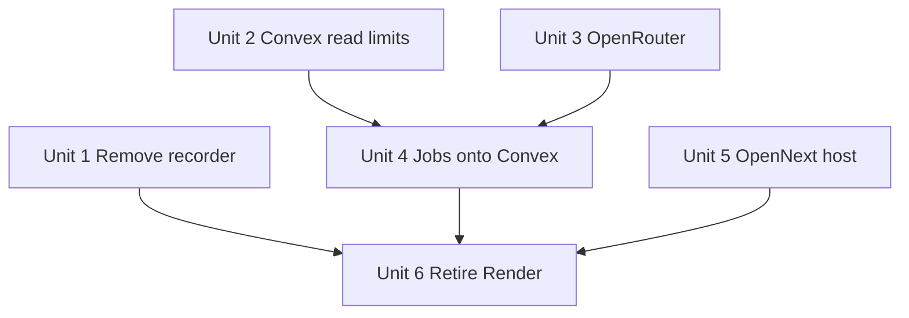

# refactor: Host on Cloudflare, score via OpenRouter, keep Convex

## Overview

Leave Render and Groq. Host the Next.js app on Cloudflare Workers with OpenNext. Score conditions through OpenRouter from the existing Convex actions. Keep Convex as the database, function layer, and scheduler.

This plan also:

- Fixes remaining Convex document-read query shape and score retention in Convex. It does not migrate to D1.
- Removes the webcam recorder feature, including the Render ffmpeg worker.

## Problem Frame

Waterman today is a Next.js app and six jobs on Render, Groq scoring inside Convex, and Convex as the only application database. Convex is cheap and matches nested score documents plus scheduled LLM retries. A D1 move is a rewrite with no user-visible gain. (see origin: `docs/brainstorms/2026-08-25-cloudflare-openrouter-requirements.md`)

Document-read limits already bit hot queries (April 2026 near 32k docs; August 2026 again at 93%). The write path now keys system scores on `(spotId, sport, timestamp)` and drains duplicates. Retention and a few unbounded collects remain. Those stay Convex problems.

The recorder is an Express + ffmpeg process on Render `waterman-recorder`. Workers cannot run ffmpeg. The product decision is to remove the feature rather than port it.

## Requirements Trace

- R1–R2. Keep Convex. No D1 / DO / KV data move.
- R3, R7–R9. Groq → OpenRouter in the existing scoring actions. Keep prompt, JSON object, temperature, token limit, retry cadence. Record provider and model on score rows.
- R4. Host Next.js on Cloudflare.
- R5. Remove every Render service after cutover, including the recorder.
- R6. Keep the email Worker. Drop app use of the R2 recordings bucket.
- R10–R12. Scrape, station poll, scoring, and fx ingest keep running without Render. Prefer Convex crons.
- R13–R15. Stay under Convex 32k-doc / 16MB query limits by query shape and retention. Do not re-key `saveConditionScore`.
- R16. Remove recorder UI, routes, Convex module, worker, and recorder-only npm packages.
- R17. Keep Windy, Windguru, Open-Meteo, IPMA, Quanteec, IOL Beachcam as sources.

## Scope Boundaries

- No Convex → D1 (or other Cloudflare database) migration.
- No rewrite of screens off `ConvexHttpClient` / `ConvexReactClient`.
- No change to sport rules, score meaning, or forecast geometry.
- No Python LightGBM training move.
- No recorder stub. Remove the feature.
- Resend stays retired.

## Context & Research

### Relevant Code and Patterns

- Scoring: `convex/spots.ts` (`scoreSingleSlot`, `scoreForecastSlots`), `convex/personalization.ts` (`scorePersonalizedSlot` and batch wrappers). OpenRouter `openai/gpt-5.6-luna` (was Groq `openai/gpt-oss-120b`, then Qwen Instruct).
- Score write path (already fixed): `convex/spots.ts` `saveConditionScore`; guard test `tests/convex/conditionScoreDedupeGuard.test.mjs`.
- Hot reads: `convex/queryHelpers/forecastSlots.ts`, `convex/queryHelpers/conditionScores.ts`, `convex/spots.ts` `getDashboardData` / `getReportData` / `getCamsData`.
- Prior read plans: `docs/plans/2026-04-10-003-fix-convex-query-document-read-limits-plan.md`, `docs/plans/2026-08-05-006-fix-condition-scores-read-amplification-plan.md`, `docs/superpowers/plans/2026-05-29-convex-query-optimization.md`.
- Remaining unbounded collects: `convex/auth.ts` `getExpiredMagicLinks` / `getExpiredSessions` (full table); several `personalization.ts` and `admin.ts` lists; `forecastExperiment.ts` `fx_forecast_runs.collect()`.
- Scrape: `scripts/scrape.mjs` plus `lib/scraper.js`; admin duplicate in `convex/admin.ts` `triggerScrape`. Station poll already `convex/crons.ts` → `internal.stations.pollStations`.
- Recorder: `scripts/recorder-worker.mjs`, `render.yaml` `waterman-recorder`, `app/api/recordings/start|stop`, `app/recordings/page.js`, `components/webcam/RecordButton.js`, `convex/recordings.ts`, `convex/schema.ts` `recordings` table.
- Email already on Cloudflare: `workers/email/`, `convex/auth.ts` `sendMagicLinkEmail`.
- Smoke: `scripts/verify-convex-reads.mjs`.

### Institutional Learnings

- August 2026 read-limit recurrence was `condition_scores` duplication keyed on `slotId` while each scrape creates a new slot document. The write path now keys on hour. Retention was deferred in April and again in August; that is why this plan ships a cron.
- A separate Render worker can die unnoticed (`waterman-fx-observations` died 2026-06-10). Prefer Convex crons for jobs that must not vanish.

### External References

- OpenNext Cloudflare adapter supports Next.js 16, including `'use cache'` / composable caching. Prefer Workers + OpenNext, not Pages. Docs: https://opennext.js.org/cloudflare and https://developers.cloudflare.com/workers/framework-guides/web-apps/nextjs/
- OpenRouter chat completions: `https://openrouter.ai/api/v1/chat/completions` (OpenAI-compatible). Same JSON-object response format as Groq.

## Key Technical Decisions

- **Keep Convex.** Nested documents and `ctx.scheduler.runAfter` retries fit Convex. D1 is not cheaper once you count the rewrite. (see origin)
- **Fix document reads in Convex, not by leaving Convex.** Finish query bounds, auth indexes, and score retention. Do not re-implement `saveConditionScore`.
- **OpenRouter from Convex actions, direct.** No AI Gateway in this project.
- **Scoring model: `openai/gpt-5.6-luna`.** This job is rubric JSON (0–100, short reasoning), not chain-of-thought. Send `reasoning.effort: none`. Keep `json_schema` (score 0–100, reasoning string, factors object with every key required — OpenAI structured output rejects a nested object that omits `required`). Temperature 0.3.
- **OpenNext on Workers.** Official adapter for Next 16. `NEXT_PUBLIC_CONVEX_URL` stays. If `cacheComponents` fails on the adapter, drop that Next flag rather than stay on Render.
- **Jobs prefer Convex crons.** Station poll already is a Convex cron. Scheduled scrape must match `scripts/scrape.mjs` (including model forecasts) and fan out one spot per action. Fx jobs are a **port**: bundle JSON models; split the four-script labels chain; do not exec the Node scripts on a Worker.
- **Remove the recorder.** No Cloudflare Container. Delete the worker, UI, API, table, and recorder-only packages.

## Open Questions

### Resolved During Planning

- Direct OpenRouter vs AI Gateway: **direct from Convex.** Smallest change; scoring already lives in actions.
- OpenNext vs Pages: **Workers + OpenNext.** Cloudflare’s own Next 16 path. Pages is the old advice.
- Recorder after Render: **remove the feature.** User request 2026-08-25.
- Convex vs D1 for read limits: **Convex query shape.** User request 2026-08-25.

### Deferred to Implementation

- Whether `pruneDuplicateConditionScores` already ran on `adorable-anteater-323`. Measure `getReportData` document reads first. If still amplified, dry-run then apply per spot. Do not prune twice as a guess.
- (resolved) OpenRouter slug: **`openai/gpt-5.6-luna`**. Qwen Instruct (`qwen/qwen3-30b-a3b-instruct-2507`) failed hard floors (Fonte min-wave) and truncated JSON on skip slots. Luna replayed the same Groq prompts with 8/8 JSON, closer honesty, `reasoning.effort: none`.
- Whether any single fx action still exceeds 10 minutes after the split. Only then move that job to a Worker Cron Trigger with bundled JSON.

## High-Level Technical Design

> *This illustrates the intended approach and is directional guidance for review, not implementation specification. The implementing agent should treat it as context, not code to reproduce.*

```text
Browser
  -> Cloudflare Worker (OpenNext Next.js 16)
       |-- ConvexHttpClient  ->  Convex Cloud
       |-- /api/live-wind    ->  Windguru
       |-- /api/models       ->  Windy widget
       `-- /api/calendar     ->  Convex

Convex
  |-- tables (unchanged except drop recordings)
  |-- crons: auth cleanup, station poll, scrape 4x/day, score retention,
  |          fx jobs that fit
  `-- actions: scrape Windy, score via OpenRouter, email Worker

Cloudflare Email Worker  (unchanged)
OpenRouter               (replaces Groq)
Windy / Windguru / Open-Meteo / IPMA / cams  (unchanged sources)
```

Scoring HTTP (directional, not an API to copy):

- POST OpenRouter chat completions
- model `openai/gpt-5.6-luna`
- temperature 0.3, max tokens 4000, strict JSON schema (not loose `json_object`)
- `reasoning.effort: none`
- retries 30s / 1m / 5m (system) and 30s / 1m (personal)
- write the model id onto the score row so Groq-era rows stay distinct

Three Convex scoring actions share one helper. Do not leave a Groq call site.

## Implementation Units



Units 1, 2, 3, and 5 can start in parallel. Unit 4 needs scoring (Unit 3) still working and reads (Unit 2) safe before scrape volume grows. Unit 6 is last.

- [x] **Unit 1: Remove the recorder feature including the worker**

**Goal:** Users cannot record. No ffmpeg process. No Render recorder service.

**Requirements:** R5, R6, R16

**Dependencies:** None

**Files:**
- Delete: `scripts/recorder-worker.mjs`, `app/api/recordings/start/route.js`, `app/api/recordings/stop/route.js`, `app/recordings/page.js`, `components/webcam/RecordButton.js`, `convex/recordings.ts`
- Modify: `render.yaml` (drop `waterman-recorder`), `convex/schema.ts` (drop `recordings` table), `components/webcam/WebcamFullscreen.js` (drop `RecordButton`), `components/auth/UserMenu.js`, `components/layout/MobileMenu.js`, `app/ui-kit/page.js` (kit entry only; `fixtures.js` has no RecordButton), `package.json` (remove `@aws-sdk/client-s3`, `@aws-sdk/lib-storage`, `express` if nothing else imports them)
- Test: assert `/recordings` is gone; ui-kit no longer lists `RecordButton`

**Approach:**
- Delete the feature end to end. Do not leave a “coming soon” page.
- Before the schema drop, delete existing `recordings` documents (internal mutation or dashboard). Convex can reject a table drop while rows remain.
- Existing R2 objects are orphan media. Deleting the Cloudflare bucket is an ops step in Unit 6.
- Confirm no other file imports AWS SDK or Express before removing the packages.
- A repo-wide `ffmpeg` grep will still hit docs. Limit the runtime check to `app/`, `components/`, `convex/`, `scripts/`, `package.json`.

**Patterns to follow:**
- Webcam UI still plays HLS through `WebcamCard` / `TvMode`. Only the record control goes.

**Test scenarios:**
- Happy path: fullscreen cam renders play/pause and sport chrome without a record control.
- Edge case: `/recordings` returns 404.
- Edge case: User menu and mobile menu have no Recordings link.
- Integration: `npx convex dev --once` succeeds with `recordings.ts` gone and schema without the table.

**Verification:**
- No `ffmpeg`, `RecordButton`, or `RECORDER_WORKER_*` references in runtime code.
- `render.yaml` has no `waterman-recorder`.

- [x] **Unit 2: Fix remaining Convex document-read limits in Convex**

**Goal:** Hot queries stay well under 32k documents / 16MB as data grows. Query shape and retention, not a new database.

**Requirements:** R1, R13–R15

**Dependencies:** None

**Files:**
- Modify: `convex/crons.ts`, `convex/auth.ts`, `convex/schema.ts` (add `magic_links.by_expiresAt` and `sessions.by_expiresAt` if missing), `convex/calendar.ts`, `convex/personalization.ts`, `convex/admin.ts`, `convex/forecastExperiment.ts`, `convex/journal.ts`, `convex/spots.ts` (collect audit only)
- Do **not** edit `convex/queryHelpers/conditionScores.ts` or `saveConditionScore` unless the live profiler shows a new bound bug. The 2-back / 7-forward window and hour-key write path already shipped.
- Test: keep `tests/convex/conditionScoreDedupeGuard.test.mjs`; add retention tests
- Measure: Convex query profiler for document reads. `scripts/verify-convex-reads.mjs` only proves the query does not throw; it cannot prove “under 25% of 32k”. Include `calendar.getSportFeed` in verification (the script already calls it).

**Approach:**
- Measure first on `adorable-anteater-323`: `getReportData`, `getDashboardData`, `getCamsData`, `calendar.getSportFeed`. If amplification is still high, run `pruneDuplicateConditionScores` dry-run per spot, then `apply: true`. If reads are already low, skip prune.
- Add a Convex cron that deletes **system** scores (`userId === null`) older than the read window (2 days back + 7 days forward). Personalized scores stay. Paginate by spot/sport/time slice. Never `.collect()` the whole `condition_scores` table.
- Replace `getExpiredMagicLinks` / `getExpiredSessions` full-table collects with indexed range queries on `expiresAt`.
- Audit remaining `.collect()` in calendar, personalization, admin, journal, spots, and forecast-experiment. Bound any path that grows with scrapes or scores. Admin “list everything” UIs may paginate.
- Calendar feed is a named hot path (R14). Reuse the score helper window; do not `.collect()` an unbounded score range.
- Negative check (R2): no D1, Durable Objects, or KV store for these reads.

**Execution note:** Characterization-first on live read counts before prune.

**Patterns to follow:**
- `convex/queryHelpers/conditionScores.ts` window (2 back, 7 forward).
- `pruneDuplicateConditionScores` already bounds the index by sport and time slice. Retention should do the same.

**Test scenarios:**
- Happy path: scoring the same hour twice with two `slotId`s still leaves one system row (existing guard; do not weaken).
- Happy path: `calendar.getSportFeed` succeeds after the collect audit.
- Edge case: retention cron with no expired rows deletes nothing.
- Edge case: retention cron does not delete `userId !== null` rows inside the expired window.
- Error path: `verify-convex-reads.mjs` still passes for report, dashboard, cams, and calendar.
- Integration: Convex profiler document reads for report/dashboard/cams/calendar stay far below 32k / 16MB.

**Verification:**
- Live or staging profiler: report/dashboard/cams document reads far below 32k (target: under ~25% of the limit at current spot count).
- Cron list includes score retention.

- [x] **Unit 3: Replace Groq with OpenRouter in Convex scoring actions**

**Goal:** All condition scores come from OpenRouter. No `GROQ_API_KEY`.

**Requirements:** R3, R7–R9

**Dependencies:** None

**Files:**
- Create: a shared OpenRouter helper used by Convex actions
- Modify: `convex/spots.ts` (`scoreSingleSlot`, `scoreForecastSlots`), `convex/personalization.ts` (`scorePersonalizedSlot`, batch wrappers after scrape and after profile edit)
- Test: `tests/convex/openrouter.test.mjs` (mock `fetch`; this is a Node HTTP mock, not a Convex runtime)
- Modify: `package.json` (remove `groq-sdk` once unused)

**Approach:**
- One helper for every current Groq call site. POST OpenRouter chat completions with `OPENROUTER_API_KEY`. Temperature 0.3, max tokens 4000, strict JSON schema, no reasoning. Same retry delays as today.
- Default model slug `openai/gpt-5.6-luna`. Trial vs Groq and Qwen on stored prompts: Luna held min-wave better and did not hit the JSON length cap. Send `reasoning.effort: none`. Nested `factors` must list every key in `required` or OpenAI returns 400.
- Keep `model` populated so admin debug can tell Groq-era rows from OpenRouter rows.
- Set Convex env `OPENROUTER_API_KEY`. Remove `GROQ_API_KEY` after one successful scored scrape.
- Do not send scores through a Cloudflare Worker in this unit.

**Patterns to follow:**
- Existing retry loops and JSON parse in `scoreSingleSlot`.
- `tests/convex/conditionScoreDedupeGuard.test.mjs` for how Convex tests mock boundaries.

**Test scenarios:**
- Happy path: helper maps a JSON-object completion to the score shape the action already expects.
- Happy path: `scorePersonalizedSlot` uses the same helper as system scoring.
- Error path: HTTP 429 retries then succeeds.
- Error path: missing `OPENROUTER_API_KEY` returns the same empty/null failure mode Groq used (slots still save).
- Edge case: malformed model JSON does not write a fake score.

**Verification:**
- `groq-sdk` is not in `package.json`. No remaining `new Groq(` in `convex/`.
- System scoring after scrape and personal scoring after a profile save both write OpenRouter model ids.

- [ ] **Unit 4: Move scrape and fx jobs off Render onto Convex crons**

**Goal:** Forecast ingest, scoring fan-out, and fx ingest run without Render cron/worker services.

**Requirements:** R10–R12

**Dependencies:** Unit 2 (safe reads), Unit 3 (scoring provider)

**Files:**
- Create: `convex/ingest.ts` (or equivalent) — internal scrape. Do **not** copy `admin.triggerScrape`.
- Modify: `convex/crons.ts`
- Modify: `scripts/scrape.mjs` may stay as a manual operator tool that calls the same internal action. Do not require Render to invoke it.
- Fx: port each job (see table). These scripts use `node:fs` and `process.cwd()` for `data/forecast-experiment/*.json`. Convex actions and Workers have no disk. Import or inline those JSON files. A Cron Trigger cannot exec `node scripts/fx-generate-predictions.mjs`.
- Modify: `render.yaml` drop `waterman-scraper`, `waterman-fx-openmeteo`, `waterman-fx-labels`, `waterman-fx-observations`, `waterman-fx-nowcast`

**Approach:**
- Source of truth for scrape is `scripts/scrape.mjs` + `lib/scraper.js`, not `admin.triggerScrape`. The admin action inlines a second Windy parse and does **not** write model forecasts.
- Internal scrape must: skip `webcamOnly` spots; call `getForecast` and `getModelForecasts`; save slots, tides, and model slots. Leave scoring to `saveForecastSlots` (it already schedules `scoreForecastSlots`). Keep Windy as the forecast source (R17).
- Do not scrape all spots in one 10-minute Convex action. Schedule one spot per follow-up action (`ctx.scheduler.runAfter`). Convex actions time out at 10 minutes; `scoreForecastSlots` already uses 30s/1m/5m retries inside that budget.
- Cron: four times daily UTC, matching `0 0,6,12,18`.
- Station poll stays as it is (Windguru, R17).
- Fx defaults (change only if a timed run proves the 10-minute limit):

| Job | Cadence today | Default target |
| --- | --- | --- |
| Open-Meteo single runs | hourly | Convex cron, one model/location per scheduled action if needed |
| Labels + model skill + prediction scores + predict | hourly, four scripts in one Render job | **Split** into four Convex crons. Bundle ML JSON. |
| Observations (Windguru + IPMA) | every 300s | Prefer Convex interval like station poll. Do not resurrect a silent Render worker. |
| Nowcast predict | every 20 min | Convex cron if the ported action fits; else a Worker Cron Trigger that imports the same JS modules (bundled JSON), then Convex mutations |

- Negative check (R2): jobs write Convex only. No D1.

**Patterns to follow:**
- `internal.stations.pollStations` for “job lives in Convex so it cannot silently die.”
- `lib/scraper.js` for Windy parse. `scripts/scrape.mjs` for save order (slots, tides, model slots).

**Test scenarios:**
- Happy path: internal scrape of one fixture spot writes slots **and** model slots, then scoring is scheduled by `saveForecastSlots`.
- Edge case: webcam-only spots are skipped.
- Error path: Windy HTTP failure records a failed scrape and does not abort later spots.
- Error path: missing bundled ML JSON fails the fx job; it must not silently score with `DEFAULT_BAY_WIND_ML_MODEL` unless that is the explicit fallback today **and** the log says so.
- Integration: cron definitions exist for scrape and for each fx job in the table.

**Verification:**
- After deploy, one scheduled or `npx convex run` scrape writes slots without Render.
- `render.yaml` has no scraper or fx services.

- [ ] **Unit 5: Host Next.js on Cloudflare Workers with OpenNext**

**Goal:** `watermanreport.com` (or the canonical host) serves from Cloudflare, still talking to Convex.

**Requirements:** R4

**Dependencies:** None (can proceed in parallel; cut DNS after Unit 4 if jobs still need the old web for `/api/*` during transition)

**Files:**
- Create: `wrangler.jsonc` (or `wrangler.toml`) at repo root, `open-next.config.ts` as the adapter requires
- Modify: `package.json` scripts (`preview` / `deploy` via `@opennextjs/cloudflare` + wrangler), `next.config.js` only if the adapter needs an explicit setting
- Create: `.github/workflows/deploy.yml` optional but useful (none exists today)
- Test: existing vitest + a smoke of `/`, `/api/live-wind/...`, `/api/models/...` against `wrangler` local or a preview URL

**Approach:**
- Follow current OpenNext Cloudflare getting-started for Next 16. Enable `nodejs_compat`.
- Keep `NEXT_PUBLIC_CONVEX_URL` and `NEXT_PUBLIC_APP_URL`. Set them in Wrangler secrets/vars, not Render.
- Exercise `'use cache'` paths (`lib/convex-cache.js`) on a preview. If they fail, remove `cacheComponents` and the `"use cache"` wrappers rather than block the move.
- Workers have no real disk. Audit every Next path that uses `fs` or `process.cwd()` before cutover. Known:
  - `app/changelog/page.js` reads `CHANGELOG.md`
  - experiment APIs under `app/api/experiment/` load `data/forecast-experiment/*.json` through `lib/forecast-experiment/*`
- Bundle those files, or the changelog and experiment routes will fail or silently use default ML models.
- `/api/live-wind` and `/api/models` stay as Windy/Windguru proxies (R17). The in-process `Map` cache on `/api/models` will reset per isolate; treat it as best-effort, not Render parity.
- Move `puppeteer` to `devDependencies` and drop the `postinstall` Chrome download in this unit. The Worker bundle must not ship Chrome.
- Do not cut production DNS until a preview URL passes the smoke list below. Unit 6 is the DNS cut.

**Patterns to follow:**
- Email worker already uses Wrangler (`workers/email/wrangler.jsonc`). Root app config is separate. Do not merge the email worker into the Next app.

**Test scenarios:**
- Happy path: `/` and report/dashboard render on a Cloudflare preview with Convex data. Both themes.
- Happy path: `GET /api/live-wind/<known-station>` returns JSON or 404 for a dead station, not a Worker crash.
- Happy path: changelog page renders. One experiment outlook route returns data (not the default-model silent fallback).
- Happy path: `/api/calendar/.../feed.ics` returns ICS.
- Edge case: missing `NEXT_PUBLIC_CONVEX_URL` fails the build or boot in a clear way.
- Integration: magic-link request still schedules the email Worker (Convex action unchanged).

**Verification:**
- Preview URL smoke list above is green. Production DNS cut is Unit 6.

- [ ] **Unit 6: Retire Render and clean ops docs**

**Goal:** Production traffic and jobs do not use Render. Docs match.

**Requirements:** R5, R6

**Dependencies:** Units 1, 4, 5

**Files:**
- Delete or archive: `render.yaml`, `RENDER_SETUP.md` (replace with a Cloudflare deploy section in `README.md`)
- Modify: `README.md`, `SOP.md`, `AUTH_SETUP.md` (Render → Cloudflare; drop Resend leftovers if still present)
- Modify: inventory/requirements only if facts change after cutover

**Approach:**
- Point `watermanreport.com` DNS at the Cloudflare Worker custom domain.
- Confirm scrape cron, station poll, scoring, and email on the live Convex deployment.
- Disable/delete Render services: `waterman`, `waterman-recorder` (already unused after Unit 1), scraper, fx.
- Delete or empty the R2 recordings bucket in the Cloudflare dashboard after Unit 1 has shipped long enough that you do not need the files. Code already stopped writing.
- Remove `GROQ_API_KEY` from Convex env.

**Test scenarios:**
- Test expectation: none as code — this is cutover. Verify with a production smoke: anonymous dashboard, one scrape freshness timestamp, login email, no `/recordings`.

**Verification:**
- Render dashboard has no Waterman services in play.
- SOP tells an operator to use Cloudflare and Convex, not Render.

## System-Wide Impact

- **Interaction graph:** Next.js route handlers, Convex actions/crons, email Worker, Windy/Windguru fetches. Recorder HTTP (`RECORDER_WORKER_URL`) disappears. Groq client disappears.
- **Error propagation:** OpenRouter failures must match today’s Groq behaviour: log, skip score, keep slots. Scrape failures per spot must not abort the run.
- **State lifecycle risks:** Score retention deletes old system rows; personalized rows stay. Prune is optional and measured. Recorder table drop orphans R2 objects until ops delete the bucket.
- **API surface parity:** Public JSON/ICS routes stay. Recording start/stop go away.
- **Integration coverage:** Browser smoke after OpenNext preview; Convex read probe; one scored scrape after OpenRouter.
- **Unchanged invariants:** SportProvider sports, `useCoastData`, wind FROM stored / TO displayed, day-chart geometry, email from `waterman@radx.dev`.

## Risks & Dependencies

| Risk | Mitigation |
|------|------------|
| OpenRouter slug differs from Groq | Try `openai/gpt-oss-120b` first; compare one spot’s JSON to a recent Groq score before full scrape |
| OpenNext `cacheComponents` gap | Preview early in Unit 5; drop the flag if needed |
| Convex action time for scrape/fx | Probe during Unit 4; only then add a Cron Trigger Worker |
| Score prune deletes useful rows | Measure; dry-run; `userId === null` only; newest row kept |
| Shared prod/dev Convex | Sequence OpenRouter env and prune with a backup in the Convex dashboard first |
| DNS cut with jobs still on Render | Unit 4 before Unit 6. App can move earlier if jobs already Convex |
| Puppeteer Chrome on CF build | Remove `postinstall` Chrome download |

## Documentation / Operational Notes

- Convex env: add `OPENROUTER_API_KEY`; remove `GROQ_API_KEY` after success.
- Wrangler vars: `NEXT_PUBLIC_CONVEX_URL`, `NEXT_PUBLIC_APP_URL`.
- Operator runbook: scrape is `npx convex run` / cron, not Render.
- R2 recordings bucket: delete after Unit 1 if no legal hold on files.
- Email Worker and `radx.dev` Email Service: no change.

## Sources & References

- **Origin document:** [docs/brainstorms/2026-08-25-cloudflare-openrouter-requirements.md](../brainstorms/2026-08-25-cloudflare-openrouter-requirements.md)
- Inventory: [docs/brainstorms/2026-08-25-cloudflare-openrouter-inventory.md](../brainstorms/2026-08-25-cloudflare-openrouter-inventory.md)
- Prior read-limit plans: `docs/plans/2026-04-10-003-fix-convex-query-document-read-limits-plan.md`, `docs/plans/2026-08-05-006-fix-condition-scores-read-amplification-plan.md`
- Recorder origin: `docs/plans/2026-04-13-002-feat-webcam-session-recording-plan.md`
- Related code: `convex/spots.ts`, `convex/personalization.ts`, `convex/crons.ts`, `scripts/recorder-worker.mjs`, `render.yaml`
- External: https://opennext.js.org/cloudflare , https://openrouter.ai/docs
