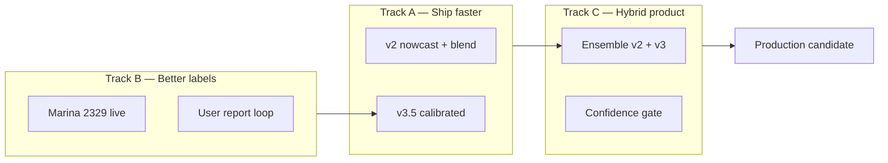

# Bay Wind Prediction — Improvement Plan

**Date:** 2026-05-25 (Phase 2 addendum: 2026-05-25)  
**Status:** In progress — A1 + v4 rule ensemble shipped; v4 did not pass acceptance  
**Baseline:** Summer 2025 backtest on `/experiment/prediction-models`  
**Prior work:** [v2/v3 implementation plan](./2026-05-25-cascais-bay-wind-prediction.md), [model analysis learnings](../../forecast-experiment-model-analysis-learnings.md)

---

## What we know today

| Model | Strength | Weakness |
|-------|----------|----------|
| **v1** baseline-ensemble | Solid day-ahead MAE (~211 min @ 12 kt); blended models + Cabo boost | Opaque blend; not bay-specific |
| **v2** bay-wind-v2 (live) | Explainable; moderate false + (~28 days @ 12 kt) | Day-ahead MAE ~257 min; ICON7-only |
| **v3.5** bay-wind-v3.5-ml | **Best overall** — MAE ~90 min, false+ **2**, precision **98%** | Needs LOOCV to confirm not 2025-overfit |
| **v4** bay-wind-v4-ensemble | Better MAE than v2 alone (133 min) | **Failed acceptance** — false+ **28** (same as v2); worse than v3.5 |

**v4 diagnosis:** Rule ensemble uses `rideable = v2Rideable OR v3Confident`. Every v2 false positive passes through; v3.5 calibration never vetoes v2. Timing blend pulls MAE between v2 and v3 but does not fix precision.

| Model | Summer 2025 @ 12 kt | MAE | False+ | False− |
|-------|---------------------|-----|--------|--------|
| v2 | 257 min | 28 | 9 |
| v3.5 | **90 min** | **2** | 1 |
| v4 | 133 min | 28 | 4 |

**Core tension:** v3 nails *when* wind arrives on days it does arrive, but cries wolf too often. v2 is conservative and explainable but late. The product goal is **trustworthy kick-in timing**, not minimum MAE alone.

**Success metrics (unchanged):**

- Kick-in MAE ≤ 60 min on nortada days (marina-sustained threshold crossing)
- False + and false − both low at chosen rideability preset
- Confidence score calibrated: high-confidence days are right more often

---

## Strategy: three parallel tracks



Do **Track B** continuously. Prioritize **Track A** for quick wins, then **Track C** for the model we eventually show foiler-facing UI.

---

## Track A — Quick wins (1–2 weeks)

### A1. v3 calibration — cut false positives ✅ (2026-05-25)

Shipped **bay-wind-v3.5-ml** with rideable-day classifier, per-preset tuned thresholds, and probability damping. Retrain: `npm run fx:train:bay-ml`.

**Summer 2025 @ 12 kt after calibration:**

| Version | MAE | Within ±1h | Precision | Recall | False + | False − |
|---------|-----|------------|-----------|--------|---------|---------|
| v2 | 257 min | 24/91 | 77% | 91% | 28 | 9 |
| v3 (pre-cal) | ~89 min | — | — | — | ~52 | 0 |
| **v3.5** | **90 min** | **46/99** | **98%** | **99%** | **2** | **1** |

**Acceptance met:** false + dropped ≥30%; MAE ≤120 min.

---

### A2. v2 structural fixes — close gap to v1 without ML

| Step | Action |
|------|--------|
| 1 | **Blend ICON7 + ICON13 + GFS** in v2 timeline (same models v3 uses), not ICON7-only |
| 2 | Apply **Cabo lag boost at 07:00 cutoff** when Cabo already sustained (match v1 behaviour) |
| 3 | Re-mine bias/lag on **2024+2025** with per-preset thresholds (2026 marina obs unavailable) |
| 4 | Seasonal coefficient refresh script on cron (monthly `fx:mine:bay`) |

**Acceptance:** v2 MAE ≤ 180 min @ 12 kt; false − stays ≤12.

---

### A3. Live nowcast loop (see updated Phase 2 plan for full scope)

Nowcast is the high-accuracy, same-day tightening layer (distinct from day-ahead Forecast). It is the primary place where live station data (Cabo + eventually marina) delivers major value.

Key elements (detailed in the Phase 2 plan):
- Dedicated “Today’s Nowcast” block in the UI as part of a continuous prediction experience.
- v3.5 extended with dynamic Cabo at inference time for same-day runs (plus possible dedicated nowcast head).
- Frequent re-runs when fresh station data exists.
- Separate scoring for nowcast vs day-ahead performance.
- Aggressive accuracy focus (more aggressive is welcome if it improves correctness without materially increasing false positives).

v2’s existing nowcast logic remains useful as a bridge or conservative component.

---

## Track B — Labels & data (ongoing)

Better labels improve every model.

| Priority | Item | Why |
|----------|------|-----|
| **P0** | Restore **Windguru 2329** marina anemometer | Direct bay ground truth; ends Cabo-lag inference bias |
| **P1** | Weight **user reports** in training (`rideable`/`strong` → soft kick-in time) | Fills gaps while 2329 is dead; aligns with product |
| **P2** | **Leave-one-summer-out** CV on **2024↔2025 only** | Avoid Summer 2025 overfit; 2026 marina dead since Apr 2026 |
| ~~**P3**~~ | ~~Add 2026 summer to Average~~ | **Blocked** until Windguru 2329 restored — see [Phase 2 plan](./2026-05-25-bay-wind-prediction-phase-2.md) |
| **P4** | Tag days: **nortada / sea breeze / frontal / flat** | Enables regime-specific models and UI copy |

**Acceptance:** ≥80% of comparable days use marina-obs labels (not lag-inferred) once 2329 live.

---

## Track C — Hybrid model (v4)

### C0. Rule ensemble v4 — shipped, did not pass ❌

Hand-tuned `bay-wind-v4-ensemble` in `bayWindPredictionV4.js`. See diagnosis above.

**Next:** C1 (learned meta) or C0.1 (precision-first rules) below — do not promote v4 rules to production.

### C0.1. v4.1 precision-first rules (3–5 days)

Invert the gate so v3.5 is the **rideability veto**, not v2:

| Rule | Behaviour |
|------|-----------|
| Day rideable | `v3.5 rideable-day classifier` AND (`v2 rideable` OR `v3 timeline` OR Cabo sustained) |
| Kick-in time | If both v2+v3 timelines: blend (current weights); elif v3 only: v3; elif v2 only: v2 **only if** v3 session ≥ floor |
| Flat day | If v3.5 says no session → no kick-in regardless of v2 |

**Acceptance:** false+ ≤5 @ 12 kt Summer 2025; MAE ≤110 min.

### C1. Stacked ensemble (`bay-wind-v4-ml`)

```
v2 timeline (rule-based, conservative)
v3 timeline (ML, aggressive)
        ↓
meta-model OR simple rules:
  - if v2 says no kick-in AND v3 confidence < 0.6 → no kick-in
  - if Cabo sustained → prefer v3 timing with v2 lag floor
  - kick-in P50 = weighted blend or max(v2, v3) by regime
```

| Step | Action |
|------|--------|
| 1 | Export **v2 + v3 outputs as features** in ML dataset (not just raw NWP) |
| 2 | Train lightweight **meta-classifier**: rideable day yes/no + kick-in residual |
| 3 | Backtest v4 vs v2/v3 on 2024 holdout |
| 4 | UI: “Model v4” toggle + feature importance for false + days |

**Acceptance:** MAE ≤100 min AND false + ≤25 @ 12 kt on Summer 2025 (beat both alone).

---

### C2. Confidence users can trust

| Step | Action |
|------|--------|
| 1 | Define confidence from **calibrated probability spread**, not wind spread alone |
| 2 | Bucket backtest days: high/med/low confidence → show hit rate per bucket |
| 3 | Surface on dashboard: “High confidence · usually ±45 min” |

---

### C3. Per-user threshold (already parameterized)

Rideability presets exist (`windfoil` 10 / `wingfoil-light` 12 / `wingfoil-heavy` 15 kt).

| Step | Action |
|------|--------|
| 1 | Store user preset in profile / localStorage |
| 2 | Generate three prediction rows or one row with chosen preset |
| 3 | Backtest overview defaults to user preset |

---

## Track D — Production path (after Track A + C)

| Gate | Criteria |
|------|----------|
| **Experiment default** | v4 (or calibrated v3) beats v2 on both MAE and false + |
| **Live worker** | Switch `fx-generate-predictions` with `FX_PREDICTION_VERSION=v4` |
| **User-facing** | Foiler UI outside `/experiment` — only after one scored month live |
| **Production forecast** | Still separate from `/wing` LLM scoring until explicitly merged |

Do **not** replace production `/wing` paths until marina labels validate for a full summer.

---

## Recommended execution order (updated after v3.5 + v4)

| Phase | Work | Effort | Impact |
|-------|------|--------|--------|
| **1** ✅ | A1 v3.5 calibration + UI metrics | done | High |
| **2** ✅ | C0 rule v4 + backtest wiring | done | Learned — needs C0.1 or C1 |
| **3** | **D0 Ship v3.5 to live worker** | 0.5 day | High — best model today |
| **4** | **B2 LOOCV validation report** | 1 day | High — trust before prod claims |
| **5** | **C0.1 v4.1 precision-first** OR **C1 meta-ML** | 3–7 days | High — fix hybrid path |
| **6** | A2 v2 blend + Cabo-at-cutoff | 2–3 days | Medium — improves v2 leg + nowcast |
| **7** | A3 nowcast refresh loop | 2–3 days | Medium — same-day UX |
| **8** | B0 marina 2329 + user reports | external | Critical long-term |
| **9** | D foiler-facing UI | 1–2 weeks | After one scored month on v3.5 |

---

## Experiments to run next (concrete)

```bash
# 1. Full preset comparison (already on /experiment/prediction-models)
FX_BACKTEST_SEASON=2025 npm run fx:backtest:predictions -- --all-presets

# 2. LOOCV: train 2024 / test 2025 and train 2025 / test 2024 (marina obs only — no 2026 labels)
npm run fx:export:ml-dataset -- --all-presets
npm run fx:train:bay-ml -- --holdout 2025

# 3. Re-mine v2 coefficients after blend change
npm run fx:mine:bay -- --season average

# 4. Score live predictions weekly
npm run fx:score:predictions
```

---

## Risks

| Risk | Mitigation |
|------|------------|
| v3 gains are 2025-overfit | LOOCV 2024↔2025; exclude lag-inferred labels from tuning |
| Summer 2026 unusable | Marina 2329 offline since Apr 2026 — no new obs for labels/backtest |
| False + hurts user trust more than late forecast | Optimize for precision first on foiler-facing copy |
| Marina gauge stays dead | User reports + Cabo lag; document uncertainty in confidence |
| ML ops burden | Keep JSON tree export; optional LightGBM on M3 Max only for training |

---

## Open questions

1. ~~Ship calibrated v3 before v4?~~ **→ Ship v3.5 now;** revisit hybrid only if C0.1/C1 beats v3.5 on LOOCV.
2. **Is zero false − worth 50+ false +?** **No** — v3.5’s 1 false− for 2 false+ is the right tradeoff.
3. **Guincho obs** — add as lead indicator when IPMA/Windguru feed stable?
4. **Per-preset models** — train separate calibration per 10/12/15 kt or one model + threshold only?

---

## Related docs

- **[Phase 2 development plan](./2026-05-25-bay-wind-prediction-phase-2.md)** — next phases, 2026 label constraint
- [Work on branch](../../forecast-experiment-predictions-work-on-branch.md) — full experiment + prediction summary
- [Bay wind v2/v3 implementation plan](./2026-05-25-cascais-bay-wind-prediction.md)
- [Design spec](../specs/2026-05-25-cascais-bay-wind-prediction-design.md)
- [Model analysis learnings](../../forecast-experiment-model-analysis-learnings.md)
- UI: `/experiment/prediction-models`, `/experiment/backtest`
