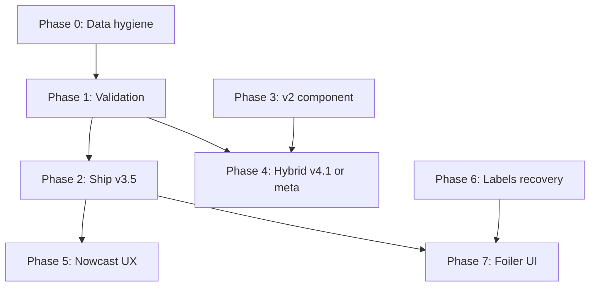

# Bay Wind Prediction — Phase 2 Development Plan

**Date:** 2026-05-25  
**Status:** Approved for execution  
**Branch:** `feat/wingfoil-forecast-experiment`  
**Prerequisite docs:** [Work on branch](../../forecast-experiment-predictions-work-on-branch.md), [Improvements plan](./2026-05-25-bay-wind-prediction-improvements.md)

---

## Ground-truth reality (updated constraint)

Windguru station **2329** (Marina CNC / Cascais Bay) has been **offline since April 2026**. There are **no new marina observations** for Summer 2026.

| Data | Usable for kick-in labels / backtest? | Usable for features / live forecast? |
|------|--------------------------------------|--------------------------------------|
| Marina 2329 obs **2024–2025 summers** | **Yes** (historical backfill) | N/A |
| Marina 2329 obs **Summer 2026** | **No** | N/A |
| Cabo 3294 live + history | Weak labels via lag inference only | **Yes** |
| User reports | Soft labels (low volume) | **Yes** |
| NWP Previous Runs | N/A | **Yes** |

**Policy for Phase 2:**

- **Supervised training & kick-in backtest:** only days with `labelStatus === "observed"` (marina), primarily **2024 + 2025** summers.
- **Do not** treat Summer 2026 or “Average (2024–2026)” as marina-validated in UI/metrics without explicit warnings.
- **Do not** use Cabo lag-inferred days to tune false-positive thresholds (circular with v2/v3 Cabo features).
- **Operational forecasting** for 2026 can continue using v3.5 + Cabo nowcast; score with user reports until 2329 returns.

---

## Forecast vs Nowcast (key product distinction)

The experiment delivers two related but distinct capabilities:

| Layer | Horizon | Primary Inputs | Role of live stations (Cabo / marina) | Primary model preference | Accuracy target |
|-------|---------|----------------|---------------------------------------|----------------------------|-----------------|
| **Kick-in Forecast** | Today + 1–7 days (planning) | NWP Previous Runs / Single Runs (ICON, GFS, ECMWF, etc.) | None (or minimal for features) | Most accurate available (v3.5 as current leader) | Low false positives, usable windows |
| **Nowcast** | Same day, as conditions develop | Latest NWP + real-time station obs | **Core input** — dramatically tightens the window | Highest accuracy possible (ML with dynamic Cabo + rules hybrid as needed) | As tight as possible (<60 min, ideally <30 min on strong days) without excessive false positives |

**Implications for 2026 (marina offline):**
- Day-ahead / multi-day **Forecast** validation remains constrained (still relies on historical 2024–2025 observed labels or weak Cabo-inferred labels).
- **Nowcast** can still be meaningfully improved and scored using live Cabo observations + user reports, even without marina truth.
- v3.5 is currently strong for the Forecast layer but needs a proper dynamic-Cabo inference path (or dedicated nowcast head) before it can fully deliver on Nowcast goals.

This distinction drives model choice, ML roadmap, UI presentation, and what “winning” means in each layer.

---

## Current model standings (marina-validated, Summer 2025 @ 12 kt)

| Model | MAE | False+ | False− | Precision | Production-ready? |
|-------|-----|--------|--------|-----------|-------------------|
| v3.5 | **90 min** | **2** | 1 | **98%** | **Yes** (best) |
| v1 | 211 min | 26 | 12 | — | Legacy compare |
| v4 rules | 133 min | 28 | 4 | — | **No** |
| v2 | 257 min | 28 | 9 | 77% | Live default today |

**Product goal (unchanged):** trustworthy “should I go?” — **precision over MAE**.

---

## Phase 2 overview



| Phase | Name | Effort | Depends on |
|-------|------|--------|------------|
| **0** | Data hygiene & honest seasons | 1–2 days | — |
| **1** | Validation without 2026 labels | 2–3 days | Phase 0 |
| **2** | Ship v3.5 live | 0.5–1 day | Phase 1 |
| **3** | v2 structural improvements (A2) | 2–3 days | Phase 0 |
| **4** | Hybrid v4.1 or meta-ML (optional) | 3–7 days | Phase 1, 3 |
| **5** | Nowcast loop (A3) | 2–3 days | Phase 2 |
| **6** | Labels & reports (B track) | Ongoing | Hardware |
| **7** | Foiler-facing UI (D) | 1–2 weeks | Phase 2 + 1 mo live score |

---

## Phase 0 — Data hygiene & honest seasons

**Goal:** Stop misleading metrics and training rows when marina truth is absent.

### 0.1 Season configuration

| Task | Detail |
|------|--------|
| Define `MARINA_LABEL_YEARS = [2024, 2025]` | New constant in `analysisSeasons.js` (or `labelQuality.js`) |
| **Average season** | Rename concept to **“Average (2024–2025)”** — only ranges with marina obs |
| **Summer 2026** | Keep for NWP skill analysis if desired; mark **“No marina labels”** in UI |
| **Backtest default** | Default season `2025`; disallow 2026 for kick-in backtest API unless `?allowWeakLabels=1` |

### 0.2 ML dataset export filters

| Task | Detail |
|------|--------|
| `fx:export:ml-dataset` | Add `--observed-only` (default **on**) — skip `lag-inferred` / `insufficient-data` |
| `train.py` | Document train years: **2024+2025 only** for supervised heads |
| Row metadata | Export `labelStatus` in JSONL for audit |

### 0.3 UI copy

| Surface | Change |
|---------|--------|
| `/experiment/backtest` | Banner when season=2026: “Marina anemometer offline — backtest unavailable” |
| `/experiment/prediction-models` | Footnote: metrics based on 2024–2025 marina observations |
| `/experiment` dashboard | Show label source for today (obs / report / cabo-inferred / none) |

**Acceptance:**

- Summer 2026 kick-in backtest returns 0 marina-comparable days (or explicit error), not lag-inferred masquerading as truth.
- Average season metrics match union of 2024+2025 only.

---

## Phase 1 — Validation without 2026 labels

**Goal:** Prove v3.5 generalizes beyond a single summer before production claims.

### 1.1 Leave-one-summer-out (LOOCV)

Only two held-out summers with marina truth:

| Holdout | Train years | Command |
|---------|-------------|---------|
| 2025 | 2024 | `npm run fx:train:bay-ml -- --holdout-year 2025` |
| 2024 | 2025 | `npm run fx:train:bay-ml -- --holdout-year 2024` |

**Report per holdout @ 12 kt:**

- MAE, false+, false−, precision, recall, F1  
- Composite score: `2×false+ + false− + MAE/120` (lower is better)

**Acceptance:**

- Both holdouts: false+ ≤10, MAE ≤120 min @ 12 kt  
- Holdout 2025 within 20% of current tuned metrics (guards overfit)

### 1.2 Regime breakdown (2024 vs 2025)

Tag each day (script or ad-hoc):

| Regime | Heuristic |
|--------|-----------|
| `nortada` | Cabo sustained ≥ threshold before 12:00, bay kicks later |
| `flat` | No bay kick, Cabo weak |
| `sea-breeze` | Late bay kick, weak Cabo morning |
| `other` | Residual |

Backtest v2 / v3.5 / v4 per regime — find where false+ cluster.

### 1.3 Preset matrix

Run `fx:backtest:predictions -- --all-presets` for seasons **2024**, **2025** separately.

**Deliverable:** `docs/forecast-experiment-validation-report.md` (generated or hand-maintained table).

**Acceptance:** Document published in repo; linked from `/experiment/prediction-models`.

---

## Phase 2 — Ship v3.5 to live worker (Forecast layer)

**Goal:** Make the most accurate model the default for day-ahead / multi-day kick-in forecasts.

v3.5 is the current best performer on historical backtests and becomes the primary engine for the **Kick-in Forecast** layer (NWP-driven, 1–7 day planning horizon). Nowcast tightening (same-day, live-station driven) is treated as a separate enhancement track (primarily Phase 5 + ML nowcast work).

### Tasks

| # | Task |
|---|------|
| 2.1 | Set `FX_PREDICTION_VERSION=v3.5` (or resolved equivalent) as default in `fx-generate-predictions.mjs` and Render `waterman-fx-labels` cron for day-ahead / multi-day forecasts |
| 2.2 | Ensure `bay-wind-v3-model.json` with `calibration` block deployed (committed artifact or build step) |
| 2.3 | Store `thresholdKnots` from `FX_RIDEABILITY_PRESET` (default `wingfoil-light`) on prediction rows |
| 2.4 | Dashboard and experiment UI clearly label the output as “Day-ahead / Multi-day Forecast” (v3.5) and show `modelVersion` + calibration preset |
| 2.5 | Keep v2 behind `FX_PREDICTION_VERSION=v2` for rollback; keep the door open for a future hybrid or v4.1 that combines strengths |

### Monitoring (4 weeks before foiler UI)

| Metric | Source |
|--------|--------|
| Day-ahead kick-in error | `fx:score:predictions` on **observed** days only |
| False+ / false− | Same, vs marina labels when 2329 returns; until then vs **user reports** |
| Nowcast uplift | Compare nowcast vs day-ahead performance on days with fresh station data (Phase 5) |

**Acceptance:**

- Live `fx_predictions` rows use `bay-wind-v3.5-ml` (or resolved version string).
- No regression in worker cron success rate.

---

## Phase 3 — v2 structural improvements (Track A2)

**Goal:** Improve the explainable / rule-based leg (primarily useful as a nowcast bridge, conservative day-ahead option, or hybrid component) — **not** to replace v3.5 as the primary day-ahead Forecast model.

### 3.1 Multi-model blend in v2

| Step | Detail |
|------|--------|
| Use ICON7 + ICON13 + GFS previous-day1 | Same set as v3 features |
| Blend | Mean effective wind per valid time (match v1 approach) |
| Backtest | `FX_BACKTEST_SEASON=2025` and `2024` |

**Target:** v2 MAE ≤180 min @ 12 kt; false− ≤12.

### 3.2 Cabo-at-cutoff boost (day-ahead)

When Cabo already sustained ≥ threshold at 07:00 Lisbon:

- Apply lag floor to kick-in (match v1 behaviour)
- Document in `inputs` for UI explainability

### 3.3 Re-mine coefficients

```bash
npm run fx:mine:bay -- --season average
```

Train miner on **2024+2025** only (`MARINA_LABEL_YEARS`).

**Acceptance:** New `bay-wind-v2-coefficients.json`; backtest v2 false+ not worse than 28 on 2025.

---

## Phase 4 — Hybrid (optional): v4.1 or meta-ML

**Only pursue if product needs v2 explainability + v3 timing in one package.**

### 4A — v4.1 precision-first rules (3–5 days)

Replace v4 OR-gate with **v3.5 veto**:

```
rideable = v3.5_session_ok AND (v2_rideable OR v3_timeline_ok)
kick_in  = blend(v2,v3) if both; else v3 if timeline; else v2 only if session ok
```

Tune weights on **2024 holdout**, evaluate on **2025**.

**Acceptance:** false+ ≤5 @ 12 kt on 2025; MAE ≤110 min; must not beat v3.5 composite on LOOCV.

### 4B — Meta-ML (5–7 days)

| Step | Detail |
|------|--------|
| Export features | v2 kick-in, v3 kick-in, session prob, regime, Cabo state |
| Train | Small classifier + residual regressor in `train.py` |
| Version | `bay-wind-v4-ml` |

**Acceptance:** Beat v3.5 composite on **both** LOOCV folds; otherwise **do not ship** — stay on v3.5 alone.

**Recommendation:** Skip 4B unless 4A fails and stakeholders require hybrid for UI narrative.

---

## Phase 5 — Nowcast (same-day tightening)

**Goal:** Highest possible accuracy on the day-of by using live station data (Cabo Raso primary while marina is offline) to tighten the kick-in window — target sub-60 min (ideally sub-30 min on strong days) without excessive false positives.

This is a **dedicated, prominent block** in the UI for “Today’s Nowcast”, presented as a continuous/refining layer on top of the day-ahead forecast (not a completely separate product).

### Key requirements
- **Continuous prediction** experience: the forecast starts as the day-ahead v3.5 output in the morning and gets progressively sharper during the day as live data arrives.
- **Dedicated Nowcast block**: Clear visual and textual separation (e.g., “Live Nowcast – last updated 14 min ago based on Cabo Raso”).
- **Model strategy**: v3.5 (or successor) is extended with a proper **dynamic Cabo path** at inference time for same-day runs (not just the 07:00 snapshot). A dedicated nowcast head or fine-tuning pass is acceptable if it meaningfully improves accuracy. Rule-based v2 nowcast logic or a lightweight hybrid can be used as a bridge or fallback.
- **Aggressiveness**: Push for the highest achievable accuracy. More aggressive thresholds or blending are welcome **if** they improve overall correctness without materially increasing false positives on rideable days.
- **2026 reality**: Nowcast can be meaningfully developed and scored using live Cabo + user reports even without marina observations.

### Tasks

| # | Task |
|---|------|
| 5.1 | Add explicit nowcast inference path to the v3.5 stack (dynamic Cabo observations at runtime for same-day calls, with appropriate feature handling or a dedicated nowcast calibration/head) |
| 5.2 | Worker / cron: re-run predictions on a frequent cadence (30–60 min or event-driven on new Cabo obs) for “today” when fresh station data exists |
| 5.3 | Store `mode: nowcast` (vs `day-ahead`) plus relevant metadata (Cabo obs age, last update time) on `fx_predictions` rows |
| 5.4 | UI: Prominent “Today’s Nowcast” block that feels like a refinement of the continuous prediction. Show last-updated time, data source (Cabo / marina), and confidence language. Keep the day-ahead / multi-day outlook clearly available alongside it. |
| 5.5 | Scoring: Separate nowcast vs day-ahead performance tracking in `fx:score:predictions`. Backtest nowcast uplift on historical days with early strong Cabo observations (2024–2025). |
| 5.6 | ML training: Add support / examples in the training pipeline for dynamic-Cabo nowcast scenarios (or a dedicated nowcast head) so future retrains can optimize the same-day tightening path. |

**Acceptance:**
- Nowcast produces materially tighter kick-in windows than the morning day-ahead forecast on days when Cabo (or marina) is already strong.
- Clear UI separation with a dedicated nowcast block while preserving a continuous overall prediction experience.
- v3.5 (or successor) has a working dynamic-Cabo inference path for same-day runs.
- Nowcast performance is tracked and reported separately from day-ahead metrics.

---

## Phase 6 — Labels recovery (Track B, ongoing)

**P0 — Marina 2329 hardware**

- Restore anemometer; same Windguru ID  
- Re-enable `windguru-2329` in `locations.js`  
- Validates all 2026+ predictions retroactively

**P1 — User reports as weak supervision**

| Task | Detail |
|------|--------|
| Incentivize reports on `/experiment` | “Cabo windy, bay flat” already supported |
| Training | `report-assisted` rows with lower sample weight (e.g. 0.4) |
| Scoring 2026 | Compare predictions to reports when no marina obs |

**P2 — Guincho lead indicator (optional)**

- Only if stable IPMA/Windguru feed — secondary feature for sea-breeze days

**Not viable until 2329 returns:**

- ~~Add 2026 summer to Average season~~  
- ~~Train 2024+2026, test 2025~~  
- Marina-validated LOOCV with 3 summers

---

## Phase 7 — Foiler-facing UI (Track D)

**Gates (all required):**

| Gate | Criteria |
|------|----------|
| G1 | v3.5 live ≥4 weeks, worker stable |
| G2 | LOOCV report passes Phase 1 acceptance |
| G3 | Product sign-off on precision-first copy |
| G4 | Either 2329 live **or** explicit uncertainty UX for cabo-inferred-only period |

**Scope:**

- Kick-in card on main app (not `/experiment` only)  
- User rideability preset (10/12/15 kt) from profile or localStorage  
- Confidence bucket copy from calibrated probabilities  
- **Do not** merge into `/wing` LLM scores until one full marina summer validates

---

## Success metrics (Phase 2)

Metrics are tracked separately for the two layers where possible.

| Metric | Forecast layer (day-ahead / multi-day) | Nowcast layer (same-day tightening) | Measurement |
|--------|---------------------------------------|-------------------------------------|-------------|
| Kick-in MAE (rideable days) | ≤90 min median on 2025; ≤120 min on 2024 holdout | As low as achievable (target sub-60 min, ideally sub-30 min on strong days) | Marina `observed` preferred; Cabo + reports acceptable for nowcast in 2026 |
| False positive days | ≤5 per summer @ 12 kt | Controlled — aggressive only if it improves overall accuracy | Marina `observed` preferred |
| Precision | ≥90% | High, with explicit tolerance for the accuracy-vs-FP tradeoff | TP/(TP+FP) |
| Confidence calibration | High-conf bucket ≥85% precision | Same, plus clear “nowcast-updated” language | Bucket backtest |
| Live/score drift | Weekly `fx:score:predictions` | Same, with nowcast vs day-ahead split | Observed days (or Cabo+reports proxy in 2026) |

**Note on 2026:** Forecast-layer metrics remain constrained by the lack of new marina observations. Nowcast-layer work can still be meaningfully validated and improved using live station data + user reports.

---

## Risks & mitigations (updated)

| Risk | Mitigation |
|------|------------|
| 2025 metrics overfit | LOOCV 2024↔2025; no 2026 in train |
| 2026 ops without marina truth | User reports + Cabo nowcast; clear UX disclaimer |
| Cabo lag labels bias ML | Exclude `lag-inferred` from training/tuning |
| v4 repeats v2 false+ | Abandon rule OR-gate; ship v3.5 solo |
| Station never restored | Permanent weight on reports + Guincho research |

---

## Execution checklist (ordered)

- [ ] **0.1** `MARINA_LABEL_YEARS`, fix Average season, 2026 UI warnings (Forecast vs Nowcast language)  
- [ ] **0.2** ML export `--observed-only`; train on 2024+2025  
- [ ] **1.1** LOOCV report (2024 holdout, 2025 holdout) — primarily for Forecast layer  
- [ ] **1.2** Regime breakdown doc  
- [ ] **1.3** All-presets backtest 2024 + 2025  
- [ ] **2.x** Ship v3.5 as day-ahead / multi-day Forecast default + clear UI labeling  
- [ ] **5.x** Nowcast: dynamic Cabo path in v3.5 stack + frequent updates + dedicated UI block + separate scoring  
- [ ] **3.x** v2 structural improvements (mainly useful as nowcast bridge or hybrid component)  
- [ ] **4.x** (Optional) v4.1 / meta only if hybrid is required for narrative or accuracy  
- [ ] **ML nowcast work** — add dynamic-Cabo / dedicated nowcast support in training pipeline (feeds 5.x)  
- [ ] **6.x** User report weighting; 2329 re-enable when hardware ready  
- [ ] **7.x** Foiler UI after gates (continuous prediction with prominent Nowcast block)  

---

## Commands reference

```bash
# Tests
npm run test:fx

# Backtest (marina-validated summers only, after Phase 0)
FX_BACKTEST_SEASON=2025 npm run fx:backtest:predictions
FX_BACKTEST_SEASON=2024 npm run fx:backtest:predictions
FX_BACKTEST_SEASON=2025 npm run fx:backtest:predictions -- --all-presets

# ML (observed labels only, after Phase 0)
npm run fx:export:ml-dataset -- --all-presets
npm run fx:train:bay-ml -- --holdout-year 2025
npm run fx:train:bay-ml -- --holdout-year 2024

# v2 coefficients (2024+2025 only, after Phase 0)
npm run fx:mine:bay

# Live predict
FX_PREDICTION_VERSION=v3 FX_RIDEABILITY_PRESET=wingfoil-light npm run fx:predict
```

---

## Related documents

- [Predictions work on branch](../../forecast-experiment-predictions-work-on-branch.md)  
- [Improvements plan (Tracks A–D)](./2026-05-25-bay-wind-prediction-improvements.md)  
- [Model analysis learnings](../../forecast-experiment-model-analysis-learnings.md)  
- [Wingfoil experiment plan](./2026-05-24-wingfoil-forecast-experiment.md)
