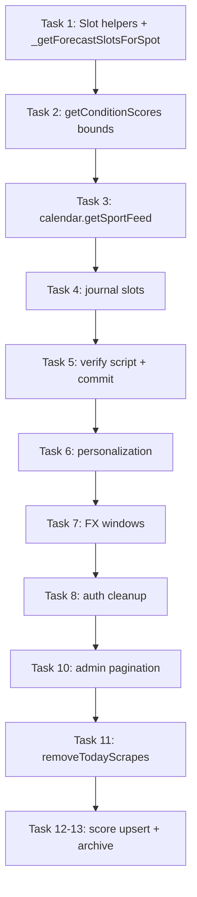

# Convex Query Optimization Implementation Plan

> **For agentic workers:** REQUIRED SUB-SKILL: Use superpowers:subagent-driven-development (recommended) or superpowers:executing-plans to implement this plan task-by-task. Steps use checkbox (`- [ ]`) syntax for tracking.

**Goal:** Eliminate unbounded Convex document reads across all public queries so batched page loads stay well under the 32k read limit as `forecast_slots`, `condition_scores`, and `scrapes` grow.

**Architecture:** Fix reads in three layers: (1) **query helpers** — shared indexed lookups with tight timestamp/scrape bounds; (2) **call sites** — calendar, journal, personalization, admin use those helpers; (3) **data lifecycle** — optional score upsert + archive so tables stop multiplying rows per scrape. Ship layers 1–2 first (immediate safety); layer 3 as a follow-up migration.

**Tech Stack:** Convex (`convex/spots.ts`, `calendar.ts`, `journal.ts`, `personalization.ts`, `forecastExperiment.ts`, `admin.ts`, `schema.ts`), Node test runner for helper unit tests, HTTP smoke scripts against dev Convex.

**Context:** Root cause of the May 2026 outage: every scrape appends new `forecast_slots` + `condition_scores` (keyed by `slotId`). Queries `.collect()` 7 days of all scrapes (~28× duplication) before in-memory dedupe. Convex counts documents **read**, not rows returned.

---

## File map

| File | Responsibility after refactor |
|------|-------------------------------|
| `convex/queryHelpers/forecastSlots.ts` | **Create** — `resolveLatestScrapeTimestamp`, `getSlotsForLatestScrape`, `getSlotsInTimestampWindow` |
| `convex/queryHelpers/conditionScores.ts` | **Create** — bounded score fetch with required sport + timestamp range |
| `convex/spots.ts` | Refactor `_getForecastSlotsForSpot`, `getConditionScores`, `removeTodayScrapes`; wire helpers |
| `convex/calendar.ts` | Fix `getSportFeed` scrapes lookup |
| `convex/journal.ts` | Replace `by_spot.collect()` in 3 functions |
| `convex/personalization.ts` | Fix `getFutureSlotsForSpot`, `getUsersNeedingPersonalizedScores` |
| `convex/forecastExperiment.ts` | Push date upper bounds into index queries |
| `convex/auth.ts` | Index-based expired session/link cleanup |
| `convex/admin.ts` | Paginate full-table admin queries |
| `convex/schema.ts` | Add indexes if needed (`scrapes.by_spot_success`, `sessions.by_expiresAt`) |
| `tests/convex/queryHelpers.test.mjs` | **Create** — pure helper tests (timestamp dedupe logic) |
| `scripts/verify-convex-reads.mjs` | **Create** — smoke script calling public queries, assert no error |

---

## Phase 1 — Shared helpers + critical user paths (ship first)

### Task 1: Extract forecast slot query helpers

**Files:**
- Create: `convex/queryHelpers/forecastSlots.ts`
- Modify: `convex/spots.ts` (`_getForecastSlotsForSpot`)

- [ ] **Step 1: Add helper module**

```typescript
// resolveLatestSuccessfulScrape(ctx, spotId) → scrapeTimestamp | null
// Uses: scrapes.by_spot_and_timestamp, order desc, filter isSuccessful OR scan last 5
//
// getSlotsForScrape(ctx, spotId, scrapeTimestamp) → Doc[]
// Uses: forecast_slots.by_spot_and_scrape_timestamp eq eq
//
// getTodayPastSlotsFromPriorScrapes(ctx, spotId, latestTs, todayStart, todayEnd) → Doc[]
// Optional: one prior scrape for today's elapsed hours only (keep current UX)
```

- [ ] **Step 2: Rewrite `_getForecastSlotsForSpot`**

Replace 7-day `.collect()` with:
1. `resolveLatestSuccessfulScrape`
2. `getSlotsForScrape` (~80–120 docs)
3. Merge today's past slots from at most one earlier scrape (indexed, bounded)

**Acceptance:** Single-spot read count drops from ~3,000 → ~150 (measure via `scripts/verify-convex-reads.mjs`).

- [ ] **Step 3: Deploy to dev Convex**

```bash
npx convex dev --once
```

- [ ] **Step 4: Smoke test report page**

```bash
node scripts/verify-convex-reads.mjs --query getReportData
curl -s "https://adorable-anteater-323.convex.cloud/api/query" \
  -H "Content-Type: application/json" \
  -d '{"path":"spots:getReportData","args":{"sports":["wingfoil"]}}'
```

Expected: success, 5 spots, 300+ slots returned.

---

### Task 2: Harden `getConditionScores` public query

**Files:**
- Create: `convex/queryHelpers/conditionScores.ts`
- Modify: `convex/spots.ts` (`getConditionScores`, `_getConditionScoresForSpot`)

- [ ] **Step 1: Unify bounds in one helper**

Mirror the fixed `_getConditionScoresForSpot` logic:
- `cutoffDays` default **2** (not 7) for dashboard/report paths
- `futureDays` default **11**
- **Require `sport`** in public `getConditionScores`; if callers omit it, iterate `spot.sports` with parallel indexed queries (never prefix-only `.collect()`)

- [ ] **Step 2: Audit callers**

Grep for `getConditionScores` and update any caller passing no sport:
- `app/calendar/page.js` — already passes sport ✅
- `app/report/[spot]/SpotReportContent.js` — verify
- Any admin paths — verify

- [ ] **Step 3: Smoke test**

```bash
node scripts/verify-convex-reads.mjs --query getConditionScores
```

---

### Task 3: Fix `calendar.getSportFeed` scrapes scan

**Files:**
- Modify: `convex/calendar.ts` (lines ~122–137)

- [ ] **Step 1: Replace full-table filter**

```typescript
// BEFORE (bad):
.query("scrapes").filter(q => q.eq(q.field("spotId"), spotId)).collect()

// AFTER:
const latestSuccessful = await ctx.db
  .query("scrapes")
  .withIndex("by_spot_and_timestamp", q => q.eq("spotId", spotId))
  .order("desc")
  .take(20); // small window; pick first isSuccessful
```

- [ ] **Step 2: Optional schema index** (if filter-on-success is hot)

Add to `schema.ts`:
```typescript
.index("by_spot_success_timestamp", ["spotId", "isSuccessful", "scrapeTimestamp"])
```

Only add if the `take(20)` loop is fragile; YAGNI until measured.

- [ ] **Step 3: Test calendar feed**

```bash
node scripts/verify-convex-reads.mjs --query getSportFeed
# Hit /api/calendar/wingfoil/feed.ics on prod after deploy
```

---

### Task 4: Fix journal slot loading

**Files:**
- Modify: `convex/journal.ts` (`findForecastSlotsForSession`, `getForecastSlotsForTimeWindow`, `getEntry` fallback)

- [ ] **Step 1: Replace `by_spot.collect()` with timestamp range**

Use `forecast_slots.by_spot_timestamp`:
```typescript
.withIndex("by_spot_timestamp", q =>
  q.eq("spotId", spotId)
   .gte("timestamp", searchStart)
   .lte("timestamp", searchEnd)
)
.collect()
```

Then dedupe by `timestamp`, prefer max `scrapeTimestamp`.

- [ ] **Step 2: Manual test**

Create journal entry for a spot/session → confirm forecast comparison still populates.

---

### Task 5: Verification script + Phase 1 commit

**Files:**
- Create: `scripts/verify-convex-reads.mjs`

- [ ] **Step 1: Script calls all public batched queries**

| Query | Args |
|-------|------|
| `spots.getReportData` | `{ sports: ["wingfoil"] }` |
| `spots.getDashboardData` | `{ sports: ["wingfoil"] }` |
| `spots.getCamsData` | `{ sports: ["wingfoil"] }` |
| `calendar.getSportFeed` | `{ sport: "wingfoil" }` |
| `forecastExperiment.experimentDashboard` | `{}` |

Exit 1 on error; print latency.

- [ ] **Step 2: Commit Phase 1**

```bash
git commit -m "fix(convex): bound forecast slot and score reads for report/calendar/journal"
```

**Phase 1 exit criteria:** All smoke queries succeed; `getReportData` estimated reads < 8k (document in script output or Convex dashboard).

---

## Phase 2 — Internal pipeline + FX queries

### Task 6: Personalization post-scrape reads

**Files:**
- Modify: `convex/personalization.ts`

- [ ] **Step 1: `getFutureSlotsForSpot`**

Delegate to shared `getSlotsForLatestScrape` helper (Task 1).

- [ ] **Step 2: `getUsersNeedingPersonalizedScores`**

Replace `users.collect()` with targeted lookup:
- Option A (minimal): paginate users `.take(100)` in loop until exhausted (scheduled action)
- Option B (better): query users where `favoriteSpots` contains `spotId` — add index `users.by_favorite_spot` or denormalized `spot_favorite_users` table

Start with **Option A**; open follow-up for Option B if user count grows.

- [ ] **Step 3: Verify scrape → personalize pipeline**

Run `npm run scrape` locally (or wait for Render cron); confirm no Convex read errors in logs.

---

### Task 7: Forecast experiment window queries

**Files:**
- Modify: `convex/forecastExperiment.ts`
- Modify: `convex/schema.ts` (only if index gap confirmed)

- [ ] **Step 1: `listPredictionsForWindow`**

Push end date into index:
```typescript
.withIndex("by_target_date", q =>
  q.eq("targetLocationSlug", slug)
   .gte("forecastDateLocal", start)
   .lte("forecastDateLocal", end)
)
```
Requires compound index field order check — may need `["targetLocationSlug", "forecastDateLocal"]` (already exists as `by_target_date`).

- [ ] **Step 2: `listObservationsForWindow` / `listForecastPointsForWindow`**

Add `.lte("observedAt", endAt)` / `.lte("validTime", endAt)` to index range; reduce `.take()` caps after bounds tightened (5000 → 2000 if safe).

- [ ] **Step 3: Run FX tests**

```bash
npm run test:fx
```

---

### Task 8: Auth cleanup queries

**Files:**
- Modify: `convex/auth.ts`
- Modify: `convex/schema.ts`

- [ ] **Step 1: Add indexes**

```typescript
sessions: .index("by_expiresAt", ["expiresAt"])
magic_links: .index("by_expiresAt", ["expiresAt"])
```

- [ ] **Step 2: Replace full collects**

Query `expiresAt < now` with index + `.take(500)` batch delete.

- [ ] **Step 3: Mark cleanup functions `internalMutation`** if currently public.

---

### Task 9: Phase 2 commit

- [ ] Run `node scripts/verify-convex-reads.mjs` + `npm run test:fx`
- [ ] Commit: `fix(convex): bound personalization, fx, and auth cleanup reads`

---

## Phase 3 — Admin pagination (auth-gated, lower urgency)

### Task 10: Admin full-table scans

**Files:**
- Modify: `convex/admin.ts`

| Function | Fix |
|----------|-----|
| `getScrapeStats` | Index + date range args; paginate |
| `getScrapes` | Same |
| `getScoringLogs` / score stats (~L790) | `by_spot_sport_timestamp` + pagination cursor |
| `getScoringDebugData` | Timestamp range + latest scrape only |
| `deleteSpot` | Index-based batch deletes (200/doc batch) |

- [ ] **Step 1:** Add shared `paginateQuery` helper or use Convex `.paginate()`
- [ ] **Step 2:** Update admin UI to pass cursors if needed (`app/admin/`)
- [ ] **Step 3:** Manual admin smoke test with session token

---

### Task 11: Fix `removeTodayScrapes` debug mutation

**Files:**
- Modify: `convex/spots.ts` (L526–575)

- [ ] Replace full-table collects with indexed queries:
  - Scrapes: `by_spot_and_timestamp` gte startOfToday per spot, or single pass with timestamp index if added
  - Slots: `by_spot_and_scrape_timestamp` for each today's scrapeTimestamp

- [ ] Mark mutation `internalMutation` or require admin token — should not be public long-term.

---

## Phase 4 — Data lifecycle (structural fix, prevents recurrence)

### Task 12: Score upsert by forecast time

**Files:**
- Modify: `convex/spots.ts` (`saveConditionScore`)
- Modify: `convex/schema.ts`

- [ ] **Step 1: Add index**

```typescript
condition_scores.index("by_spot_sport_time_user", [
  "spotId", "sport", "timestamp", "userId"
])
```

- [ ] **Step 2: Upsert logic**

On save, lookup existing row by `(spotId, sport, timestamp, userId)`; patch in place instead of insert when system score exists for that **forecast hour** (not slotId).

- [ ] **Step 3: Backfill not required** — old rows age out via Task 13; new scrapes stop multiplying.

---

### Task 13: Archive old condition_scores

**Files:**
- Modify: `convex/spots.ts` (`saveForecastSlots` archive block)
- Modify: `convex/schema.ts` — `condition_scores_archive` table (mirror slots archive)

- [ ] After each scrape, archive scores linked to archived slots OR scores with `scoredAt` / `timestamp` > 7 days old
- [ ] Batch size 200 (match slots archive pattern)

---

### Task 14: `getTimeSeriesContext` scrape preference

**Files:**
- Modify: `convex/spots.ts`

- [ ] When `scrapeTimestamp` arg provided, filter in index query not post-collect
- [ ] When omitted, pass resolved latest scrape from helper

---

## Phase 5 — Tests & monitoring

### Task 15: Unit tests for dedupe helpers

**Files:**
- Create: `tests/convex/forecastSlotDedupe.test.mjs`

- [ ] Test: given slots from 3 scrapes with overlapping timestamps, dedupe keeps latest `scrapeTimestamp`
- [ ] Test: timestamp window filter excludes out-of-range slots

### Task 16: Read budget documentation

**Files:**
- Modify: `planning/architecture.md`
- Modify: `planning/PLANNING.md`

- [ ] Document conventions:
  - Never `.collect()` on `forecast_slots` / `condition_scores` without indexed timestamp bounds
  - Batched queries must estimate reads: `spots × readsPerSpot < 20k` (headroom under 32k)
  - New tables need archive/TTL strategy if append-only

### Task 17: Optional Convex dashboard alarm

- [ ] Note in ops docs: watch function execution "documents read" for `getReportData`, `getSportFeed` after deploy

---

## Execution order (summary)



| Phase | Tasks | User impact | Est. effort |
|-------|-------|-------------|-------------|
| **1** | 1–5 | Report, calendar, journal fixed | 1–2 days |
| **2** | 6–9 | Scrape pipeline, FX, auth | 1 day |
| **3** | 10–11 | Admin/debug only | 0.5 day |
| **4** | 12–14 | Prevents future growth | 1–2 days |
| **5** | 15–17 | Tests + docs | 0.5 day |

**Total:** ~4–6 days focused work, shippable incrementally after each phase.

---

## Deploy checklist (each phase)

1. `npx convex dev --once` (dev Convex — prod app uses this DB)
2. `node scripts/verify-convex-reads.mjs`
3. Browser smoke: `/report`, `/wing/all`, `/experiment`, calendar `.ics` feed
4. Push to `main` → Render redeploys Next.js (Convex already updated)

---

## Out of scope (YAGNI)

- Materialized/cached report view in Convex (only if Phase 1–4 insufficient)
- Migrating off append-only slot storage (historical analysis uses archive tables)
- Prod Convex deployment (app uses dev DB per team convention)

---

## References

- Audit: conversation + subagent report (May 2026)
- Fixed incident: `14b6d43` — `getReportData` score window
- Schema indexes: `convex/schema.ts` lines 114–205
- Slot insert path: `convex/spots.ts` `saveForecastSlots`
